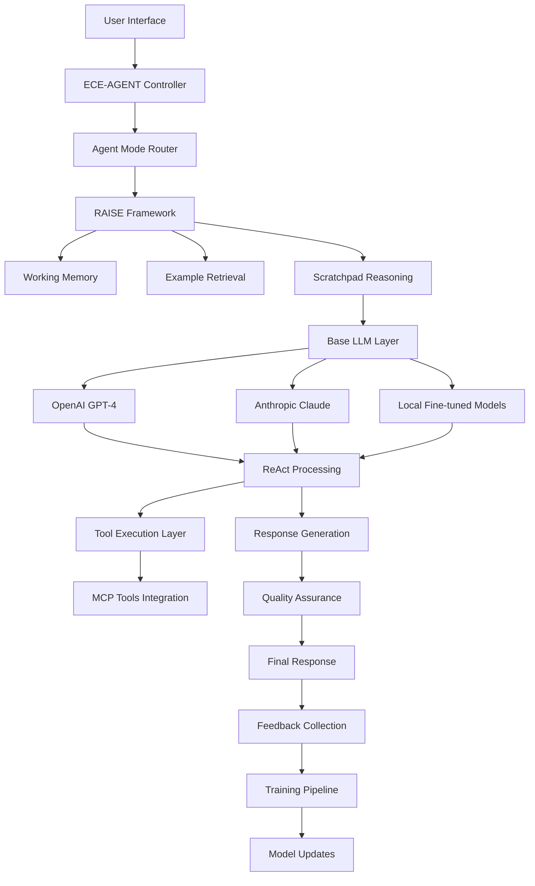

# ECE-AGENT LLM - Comprehensive Documentation

## Executive Summary

The ECE-AGENT system implements a sophisticated hybrid LLM architecture that combines existing powerful models with custom reasoning frameworks. This approach provides specialized agent modes while maintaining cost-effectiveness and rapid development capabilities.

## Architecture Overview

### Core Components



### Agent Modes

The system supports five specialized agent modes:

1. **Smart Assistant** - General productivity and task management
2. **Code Companion** - Programming assistance and debugging
3. **Creative Writer** - Content creation and narrative development
4. **Legal Assistant** - Legal analysis and compliance guidance
5. **Designer Agent** - UI/UX design and visual guidance

## Technical Implementation

### RAISE Framework

**R**easoning, **A**cting, **I**nteracting, **S**ynthesizing, **E**valuating

```typescript
interface RAISEController {
  reasoning: ReasoningEngine;
  acting: ActionEngine;
  interacting: InteractionEngine;
  synthesizing: SynthesisEngine;
  evaluating: EvaluationEngine;
}

class ECEAgentLLM {
  private raiseController: RAISEController;
  private agentModes: AgentModeManager;
  private baseLLM: BaseLLMProvider;
  
  async processQuery(query: string, mode: AgentMode): Promise<AgentResponse> {
    // 1. Reasoning Phase
    const context = await this.raiseController.reasoning.analyze(query, mode);
    
    // 2. Acting Phase
    const plan = await this.raiseController.acting.createPlan(context);
    
    // 3. Interacting Phase
    const response = await this.raiseController.interacting.execute(plan);
    
    // 4. Synthesizing Phase
    const synthesis = await this.raiseController.synthesizing.combine(response);
    
    // 5. Evaluating Phase
    const evaluation = await this.raiseController.evaluating.assess(synthesis);
    
    return evaluation.finalResponse;
  }
}
```

### ReAct Processing

The system uses Reasoning and Acting (ReAct) patterns for enhanced problem-solving:

```typescript
class ReActProcessor {
  async executeReActCycle(context: AgentContext): Promise<AgentResponse> {
    let observation = context.initialObservation;
    let reasoning: Reasoning;
    let action: Action;
    
    for (let step = 0; step < MAX_REASONING_STEPS; step++) {
      // Observe current state
      observation = await this.observe(observation, context);
      
      // Reason about next steps
      reasoning = await this.reason(observation, context.mode);
      
      // Take action based on reasoning
      action = await this.act(reasoning);
      
      // Check if task is complete
      if (action.isComplete) break;
      
      // Update observation with action results
      observation = action.result;
    }
    
    return this.synthesizeResponse(reasoning, action);
  }
}
```

## Database Schema

### Core Tables

```sql
-- Agent conversations and context
CREATE TABLE agent_conversations (
    id UUID PRIMARY KEY DEFAULT gen_random_uuid(),
    user_id UUID REFERENCES auth.users(id),
    agent_mode VARCHAR(50) NOT NULL,
    conversation_data JSONB NOT NULL,
    created_at TIMESTAMP WITH TIME ZONE DEFAULT NOW(),
    updated_at TIMESTAMP WITH TIME ZONE DEFAULT NOW()
);

-- RAISE framework examples for retrieval
CREATE TABLE agent_examples (
    id UUID PRIMARY KEY DEFAULT gen_random_uuid(),
    agent_mode VARCHAR(50) NOT NULL,
    query_embedding VECTOR(1536),
    query_text TEXT NOT NULL,
    reasoning_trace JSONB,
    tool_calls JSONB,
    response_text TEXT NOT NULL,
    success_rating INTEGER CHECK (success_rating >= 1 AND success_rating <= 5),
    tags TEXT[],
    created_at TIMESTAMP WITH TIME ZONE DEFAULT NOW()
);

-- Working memory for active sessions
CREATE TABLE working_memory (
    session_id UUID PRIMARY KEY,
    user_id UUID REFERENCES auth.users(id),
    agent_mode VARCHAR(50) NOT NULL,
    conversation_history JSONB,
    scratchpad TEXT,
    retrieved_examples JSONB,
    context_data JSONB,
    expires_at TIMESTAMP WITH TIME ZONE,
    updated_at TIMESTAMP WITH TIME ZONE DEFAULT NOW()
);

-- Reasoning traces for learning and debugging
CREATE TABLE reasoning_traces (
    id UUID PRIMARY KEY DEFAULT gen_random_uuid(),
    session_id UUID REFERENCES working_memory(session_id),
    step_number INTEGER NOT NULL,
    step_type VARCHAR(20) NOT NULL, -- 'observe', 'reason', 'act'
    content TEXT NOT NULL,
    metadata JSONB,
    execution_time_ms INTEGER,
    created_at TIMESTAMP WITH TIME ZONE DEFAULT NOW()
);

-- Training data and feedback
CREATE TABLE training_interactions (
    id UUID PRIMARY KEY DEFAULT gen_random_uuid(),
    user_id UUID REFERENCES auth.users(id),
    agent_mode VARCHAR(50) NOT NULL,
    query_text TEXT NOT NULL,
    response_text TEXT NOT NULL,
    user_rating INTEGER CHECK (user_rating >= 1 AND user_rating <= 5),
    feedback_text TEXT,
    interaction_metadata JSONB,
    created_at TIMESTAMP WITH TIME ZONE DEFAULT NOW()
);
```

## Agent Mode Specifications

### Smart Assistant Mode

**Purpose**: General productivity, task management, and information assistance

**Capabilities**:
- Task planning and scheduling
- Information retrieval and research
- Productivity workflow optimization
- Calendar and time management
- Goal setting and tracking

**Training Data Sources**:
- Productivity methodologies (GTD, PARA, etc.)
- Task management best practices
- General knowledge databases
- FAQ datasets from various domains

### Code Companion Mode

**Purpose**: Programming assistance, debugging, and code review

**Capabilities**:
- Code generation and completion
- Bug detection and debugging assistance
- Architecture review and suggestions
- Best practices recommendations
- Documentation generation

**Training Data Sources**:
- GitHub repositories (permissive licenses)
- Programming documentation
- Stack Overflow Q&A pairs
- Code review comments and patterns

### Creative Writer Mode

**Purpose**: Content creation, storytelling, and creative assistance

**Capabilities**:
- Story and narrative generation
- Character development
- Technical writing and documentation
- Marketing copy creation
- Style adaptation and editing

**Training Data Sources**:
- Literature and creative writing samples
- Journalism and article databases
- Marketing copy examples
- Style guides and writing manuals

### Legal Assistant Mode

**Purpose**: Legal analysis, compliance guidance, and document review

**Capabilities**:
- Contract analysis and review
- Legal research assistance
- Compliance checking
- Risk assessment
- Legal document drafting guidance

**Training Data Sources**:
- Legal document templates
- Case law summaries (public domain)
- Regulatory text and compliance guides
- Legal research methodologies

**⚠️ Disclaimer**: Not a substitute for professional legal advice

### Designer Agent Mode

**Purpose**: UI/UX design guidance, visual design assistance

**Capabilities**:
- User experience flow design
- Visual hierarchy and layout guidance
- Color theory and typography advice
- Design system development
- Accessibility compliance checking

**Training Data Sources**:
- Design pattern libraries
- UI/UX best practices
- Accessibility guidelines (WCAG)
- Design system documentation

## Self-Learning Pipeline

### Data Collection

```typescript
interface LearningDataCollector {
  collectInteraction(interaction: UserInteraction): Promise<void>;
  collectFeedback(feedback: UserFeedback): Promise<void>;
  collectPerformanceMetrics(metrics: PerformanceMetrics): Promise<void>;
}

class ContinuousLearningPipeline {
  async processLearningCycle(): Promise<void> {
    // 1. Collect recent interactions
    const interactions = await this.dataCollector.getRecentInteractions();
    
    // 2. Analyze conversation quality
    const qualityMetrics = await this.analyzeQuality(interactions);
    
    // 3. Identify improvement opportunities
    const improvements = await this.identifyImprovements(qualityMetrics);
    
    // 4. Generate training data
    const trainingData = await this.generateTrainingData(improvements);
    
    // 5. Update model (if threshold met)
    if (trainingData.length > TRAINING_THRESHOLD) {
      await this.updateModel(trainingData);
    }
  }
}
```

### Quality Assurance

```typescript
interface QualityAssurance {
  coherenceCheck(response: string): Promise<CoherenceScore>;
  factualityCheck(response: string, context: Context): Promise<FactualityScore>;
  biasDetection(response: string): Promise<BiasScore>;
  safetyFilter(response: string): Promise<SafetyScore>;
}

class ResponseQualityGate {
  async validateResponse(response: AgentResponse): Promise<ValidationResult> {
    const checks = await Promise.all([
      this.qa.coherenceCheck(response.text),
      this.qa.factualityCheck(response.text, response.context),
      this.qa.biasDetection(response.text),
      this.qa.safetyFilter(response.text)
    ]);
    
    return this.aggregateValidation(checks);
  }
}
```

## Implementation Status

### ✅ Completed (Phase 1)
- Basic chat interface with agent selection
- Frontend architecture with mode switching UI
- Database schema design
- Initial API structure

### 🔄 In Progress (Phase 2)
- Backend API implementation for agent routing
- RAISE framework controller
- ReAct processing engine
- Training data collection system

### ⏳ Planned (Phase 3)
- Advanced feedback analysis
- Automated training pipeline
- A/B testing framework
- Continuous model updates

### 🔮 Future (Phase 4)
- Multi-modal inputs (voice, images)
- Collaborative agent workflows
- Custom user-trained agents
- Enterprise deployment options

## Infrastructure Requirements

### Development Environment
- **Compute**: 4-8 vCPUs, 16-32GB RAM
- **Storage**: 100GB for examples, traces, and cache
- **APIs**: OpenAI and Anthropic API keys
- **Database**: Supabase with vector support

### Production Environment
- **Compute**: Auto-scaling cloud instances
- **Storage**: 500GB+ for training data and models
- **CDN**: Global content delivery
- **Monitoring**: Comprehensive logging and analytics

### Optional Fine-tuning Infrastructure
- **GPU**: Single A100 or 4x RTX 4090
- **Storage**: 500GB for datasets and checkpoints
- **Framework**: Hugging Face Transformers + PEFT

## Cost Analysis

### API-Only Approach (Current)
- **Monthly API costs**: $500-2000 (usage-dependent)
- **Infrastructure**: $100-300/month (cloud hosting)
- **Total**: $600-2300/month

### Hybrid with Fine-tuning (Future)
- **Initial fine-tuning**: $1000-5000 (one-time)
- **Monthly API costs**: $200-800 (reduced usage)
- **Infrastructure**: $300-800/month (GPU instances)
- **Total**: $500-1600/month after initial investment

## Security and Privacy

### Data Protection
- **Encryption**: End-to-end encryption for user conversations
- **Privacy Controls**: User data retention and deletion policies
- **Access Controls**: Role-based permissions for different features
- **Audit Logging**: Comprehensive activity tracking for compliance

### Model Security
- **Input Validation**: Sanitization of user inputs
- **Output Filtering**: Safety checks on generated responses
- **Rate Limiting**: Protection against abuse
- **Monitoring**: Real-time threat detection

## Performance Metrics

### Response Quality
- **Coherence Score**: Logical consistency (target: >0.8)
- **Relevance Score**: Query-response alignment (target: >0.85)
- **Helpfulness Score**: User satisfaction (target: >4.0/5.0)
- **Safety Score**: Harmful content detection (target: >0.95)

### System Performance
- **Response Time**: Average response latency (target: <2s)
- **Throughput**: Concurrent user capacity (target: 1000+)
- **Availability**: System uptime (target: 99.9%)
- **Error Rate**: Failed requests (target: <0.1%)

## Development Guidelines

### Code Standards
- **TypeScript**: Strict typing for all components
- **Testing**: ≥90% code coverage requirement
- **Documentation**: Comprehensive API documentation
- **Monitoring**: Extensive logging and metrics

### Deployment Process
- **CI/CD**: Automated testing and deployment
- **Staging**: Full environment testing before production
- **Rollback**: Quick rollback capabilities
- **Monitoring**: Real-time performance tracking

## Future Roadmap

### Q1 2025
- Complete RAISE framework implementation
- Deploy initial agent modes
- Implement feedback collection system
- Launch beta testing program

### Q2 2025
- Add fine-tuning capabilities
- Implement advanced reasoning features
- Expand tool integration (MCP)
- Launch public beta

### Q3 2025
- Multi-modal input support
- Advanced personalization features
- Enterprise deployment options
- Performance optimizations

### Q4 2025
- Collaborative agent workflows
- Custom user-trained agents
- Advanced analytics and insights
- Global scaling infrastructure

## Conclusion

The ECE-AGENT LLM represents a sophisticated yet practical approach to building specialized AI agents. By combining existing powerful models with custom reasoning frameworks, we achieve the benefits of specialized AI while maintaining development speed and cost-effectiveness.

The hybrid architecture allows for immediate deployment while providing a clear path for future enhancements through fine-tuning and advanced reasoning capabilities.
