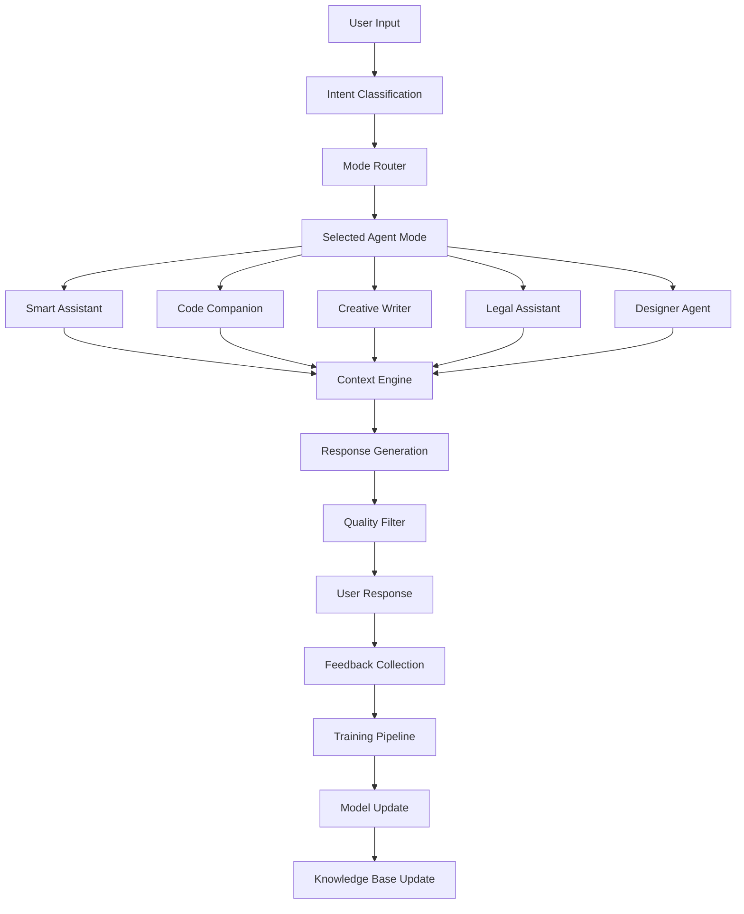
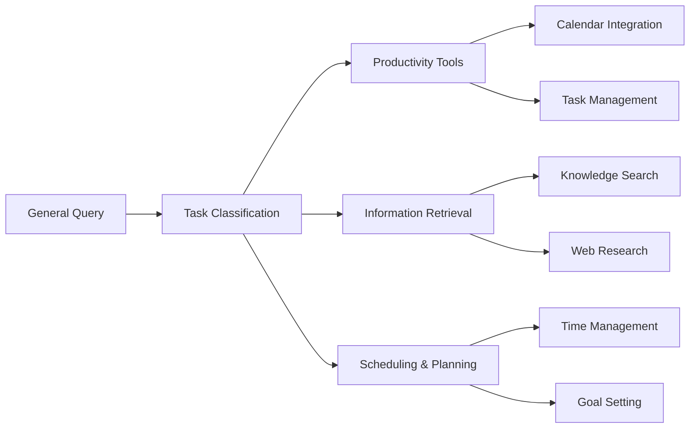
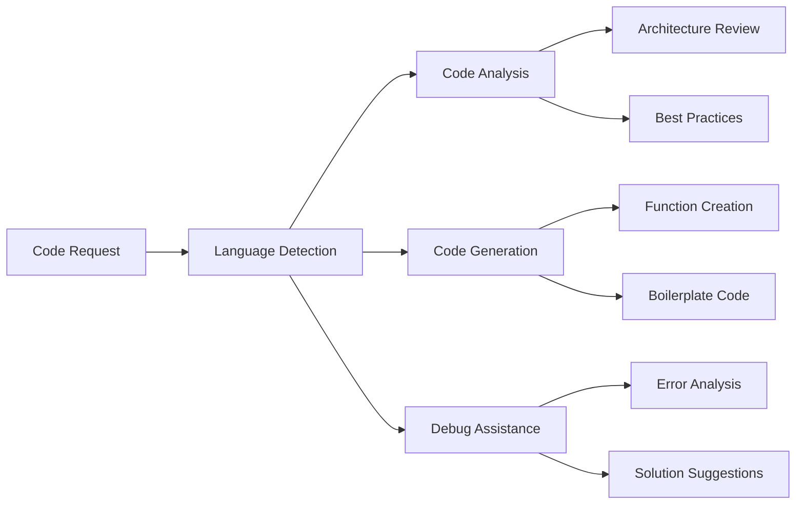
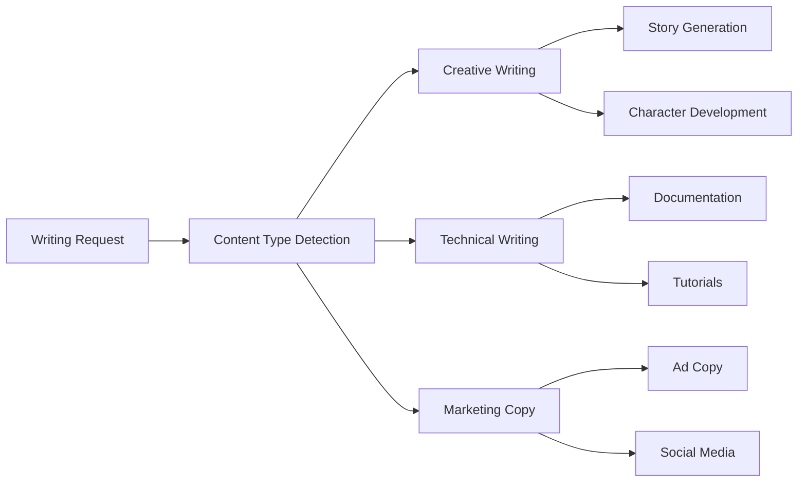
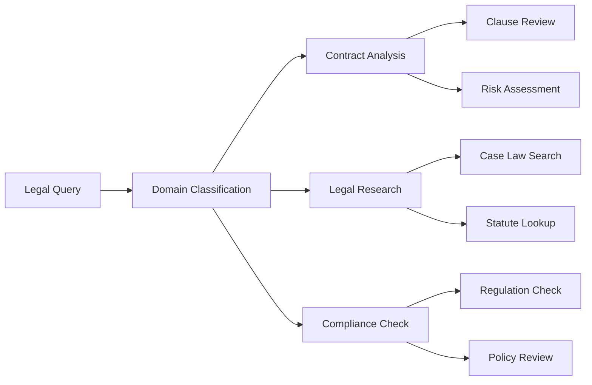
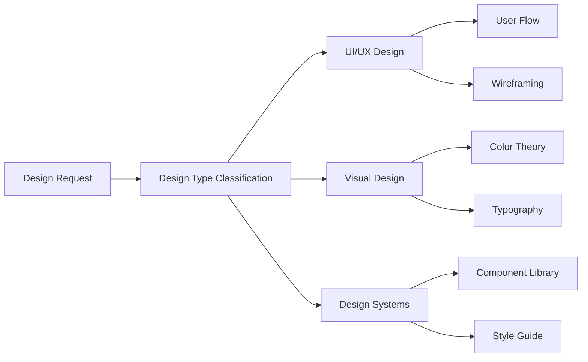
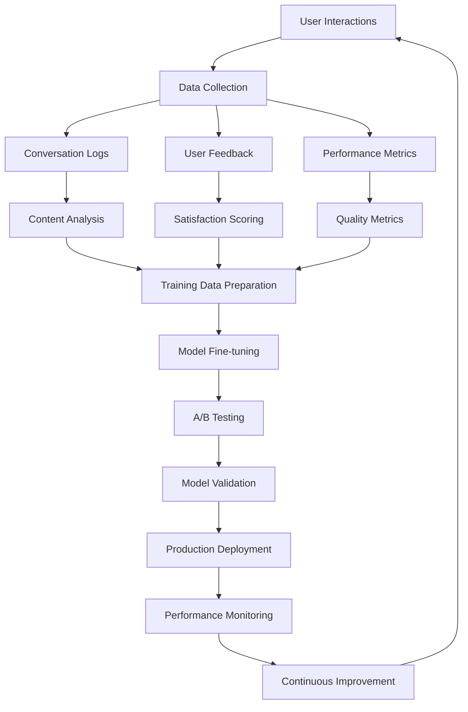

# Custom AGENT LLM Architecture

## Overview

The ECE-AGENT system features a custom-trained LLM with specialized agent modes and self-learning capabilities. This architecture enables dynamic personality switching and continuous improvement through user interactions.

## Core LLM Architecture

## Specialized Agent Modes

### Smart Assistant Mode

### Code Companion Mode

### Creative Writer Mode

### Legal Assistant Mode

### Designer Agent Mode

## Self-Learning Pipeline

## Training Data Sources

### Smart Assistant Training
- Productivity workflows and methodologies
- Task management best practices
- General knowledge databases
- FAQ datasets from various domains

### Code Companion Training
- GitHub repositories (public, permissive licenses)
- Programming documentation and tutorials
- Stack Overflow Q&A pairs
- Code review comments and suggestions

### Creative Writer Training
- Literature and creative writing samples
- Journalism and article databases
- Marketing copy examples
- Style guides and writing manuals

### Legal Assistant Training
- Legal document templates
- Case law summaries (public domain)
- Regulatory text and compliance guides
- Legal research methodologies

### Designer Agent Training
- Design pattern libraries
- UI/UX best practices
- Accessibility guidelines
- Design system documentation

## Continuous Learning Mechanisms

### Real-time Feedback Loop
1. **User Rating System**: Thumbs up/down on responses
2. **Conversation Quality Metrics**: Response relevance, helpfulness
3. **Task Completion Tracking**: Success rate of suggested solutions
4. **User Retention Analysis**: Engagement patterns and preferences

### Automated Quality Assurance
1. **Response Coherence Checking**: Logical consistency validation
2. **Factual Accuracy Verification**: Cross-reference with knowledge base
3. **Bias Detection**: Automated scanning for problematic content
4. **Safety Filtering**: Harmful content prevention

### Model Update Cycle
1. **Daily Data Collection**: Aggregate user interactions
2. **Weekly Analysis**: Identify improvement opportunities
3. **Monthly Fine-tuning**: Update model with new training data
4. **Quarterly Major Updates**: Significant architecture improvements

## Implementation Status

### Phase 1: Foundation (Current)
- ✅ Basic chat interface with agent selection
- ✅ Frontend architecture with mode switching UI
- 🔄 Backend API structure for agent routing
- 🔄 Initial training data collection

### Phase 2: Core Training (In Progress)
- 🔄 Custom model training pipeline
- 🔄 Specialized mode implementations
- 🔄 Basic feedback collection system
- ⏳ Initial model deployment

### Phase 3: Self-Learning (Planned)
- ⏳ Advanced feedback analysis
- ⏳ Automated training pipeline
- ⏳ A/B testing framework
- ⏳ Continuous model updates

### Phase 4: Advanced Features (Future)
- ⏳ Multi-modal inputs (voice, images)
- ⏳ Collaborative agent workflows
- ⏳ Custom user-trained agents
- ⏳ Enterprise deployment options

## Technical Specifications

### Model Architecture
- **Base Model**: Custom transformer architecture
- **Parameter Count**: Optimized for performance and accuracy
- **Context Window**: Extended context for complex conversations
- **Fine-tuning**: LoRA adapters for efficient specialization

### Infrastructure Requirements
- **Training**: GPU clusters for model training and fine-tuning
- **Inference**: Optimized deployment for real-time responses
- **Storage**: Vector databases for embeddings and knowledge retrieval
- **Monitoring**: Comprehensive logging and performance tracking

### Security and Privacy
- **Data Encryption**: End-to-end encryption for user conversations
- **Privacy Controls**: User data retention and deletion policies
- **Access Controls**: Role-based permissions for different features
- **Audit Logging**: Comprehensive activity tracking for compliance
