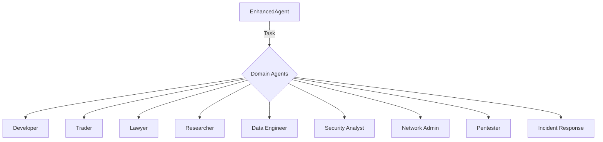

# Domain Agents Architecture

- **EnhancedAgent**: Orchestrates and delegates tasks to domain agents
- **Domain Agents**: Specialized for their respective fields
- **Extensible**: New agents can be added for new domains
