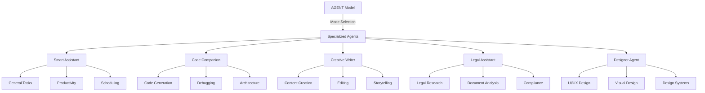

# Specialized Agent Modes Architecture

## Implementation Architecture

### Frontend Integration
- **Agent Selection UI**: Components for switching between specialized modes
- **Mode-Specific Interfaces**: Tailored UI elements for each agent type
- **Context Preservation**: Maintain conversation context across mode switches
- **Visual Indicators**: Clear mode identification and capabilities display

### Backend Services
- **Mode Router**: Intelligent routing based on user intent and explicit selection
- **Context Engine**: Shared context and memory across all agent modes
- **Specialized Processors**: Mode-specific logic and response generation
- **Training Pipeline**: Continuous learning for each specialized mode

## Specialized Agent Capabilities

### Smart Assistant
- **General Knowledge**: Broad information retrieval and synthesis
- **Task Management**: Planning, scheduling, and productivity assistance
- **Personal Organization**: Calendar integration, reminders, goal tracking
- **Information Synthesis**: Research compilation and summarization

### Code Companion
- **Code Generation**: Function creation, boilerplate code, algorithm implementation
- **Debugging Assistance**: Error analysis, solution suggestions, code review
- **Architecture Guidance**: System design, best practices, pattern recommendations
- **Documentation**: Code commenting, README generation, API documentation

### Creative Writer
- **Content Creation**: Articles, blog posts, marketing copy, creative writing
- **Editing & Proofreading**: Grammar correction, style improvement, clarity enhancement
- **Storytelling**: Narrative development, character creation, plot assistance
- **Format Adaptation**: Converting content between different formats and styles

### Legal Assistant
- **Document Analysis**: Contract review, legal document interpretation
- **Legal Research**: Case law lookup, statute interpretation, precedent analysis
- **Compliance Guidance**: Regulatory compliance, policy interpretation
- **Risk Assessment**: Legal risk identification and mitigation strategies

### Designer Agent
- **UI/UX Design**: Interface design principles, user experience optimization
- **Visual Design**: Color theory, typography, layout composition
- **Design Systems**: Component libraries, style guides, design tokens
- **Accessibility**: WCAG compliance, inclusive design principles

## Current Implementation Status

### Phase 1: Foundation (Current)
- ✅ Basic agent selection interface in chat UI
- ✅ Frontend components for mode switching
- 🔄 Backend routing infrastructure
- 🔄 Mode-specific response processing

### Phase 2: Specialized Training (In Progress)
- 🔄 Custom training datasets for each mode
- 🔄 Mode-specific fine-tuning processes
- 🔄 Context preservation across modes
- ⏳ Advanced capability implementations

### Phase 3: Advanced Features (Planned)
- ⏳ Cross-mode collaboration workflows
- ⏳ Personalized mode preferences
- ⏳ Advanced context understanding
- ⏳ Multi-modal input support

## Extensibility Framework

### Adding New Agent Modes
1. **Define Capabilities**: Specify the agent's core competencies and use cases
2. **Create Training Dataset**: Compile relevant training data for the domain
3. **Implement Mode Logic**: Develop specialized processing and response generation
4. **Design UI Components**: Create mode-specific interface elements
5. **Integration Testing**: Validate mode switching and context preservation

### Mode Customization
- **User Preferences**: Customizable behavior and response styles per mode
- **Domain-Specific Tools**: Integration with external APIs and services
- **Learning Adaptation**: Mode-specific learning from user interactions
- **Performance Optimization**: Specialized optimization for each mode's use cases
