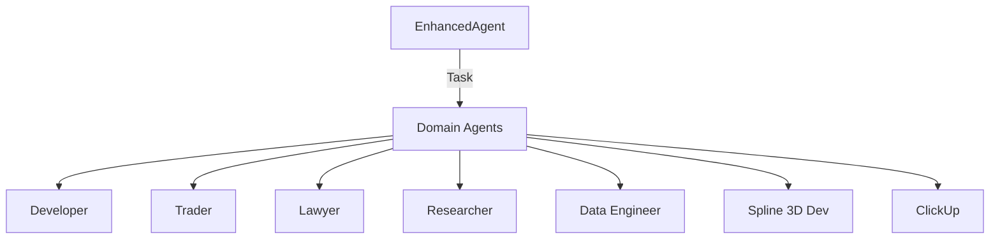

# Domain Agents Architecture

Notes and implementation anchors

- Orchestrators:
  - Core: [agent/core/core.py](agent/core/core.py)
  - Enhanced: [agent/core/enhanced_agent.py](agent/core/enhanced_agent.py)
- Implemented Domain Agents:
  - Developer: [agent/domains/developer.py](agent/domains/developer.py)
  - Trader: [agent/domains/trader.py](agent/domains/trader.py)
  - Lawyer: [agent/domains/lawyer.py](agent/domains/lawyer.py)
  - Researcher: [agent/domains/researcher.py](agent/domains/researcher.py)
  - Data Engineer: [agent/domains/data_engineer.py](agent/domains/data_engineer.py)
  - Spline 3D Dev: [agent/domains/spline_3d_developer.py](agent/domains/spline_3d_developer.py)
  - ClickUp: [agent/domains/clickup.py](agent/domains/clickup.py)

Aliases and security roles

- The following domain names are currently aliased to the Researcher agent via the domain registry:
  - security-analyst, network-admin, network-analyst, pentester, incident-response, hacker
- See mapping in [DOMAIN_AGENTS](agent/domains/__init__.py:11)

Extensibility

- New domain agents can be added by implementing a domain class and registering it in the domain registry at [agent/domains/__init__.py](agent/domains/__init__.py)

Roadmap

- Specialized Security Analyst, Pentester, and Incident Response agents with domain specific tooling beyond Researcher
- Data Scientist and Analyst agents with statistical and visualization capabilities
- Unified registry metadata with capability descriptors and health checks
