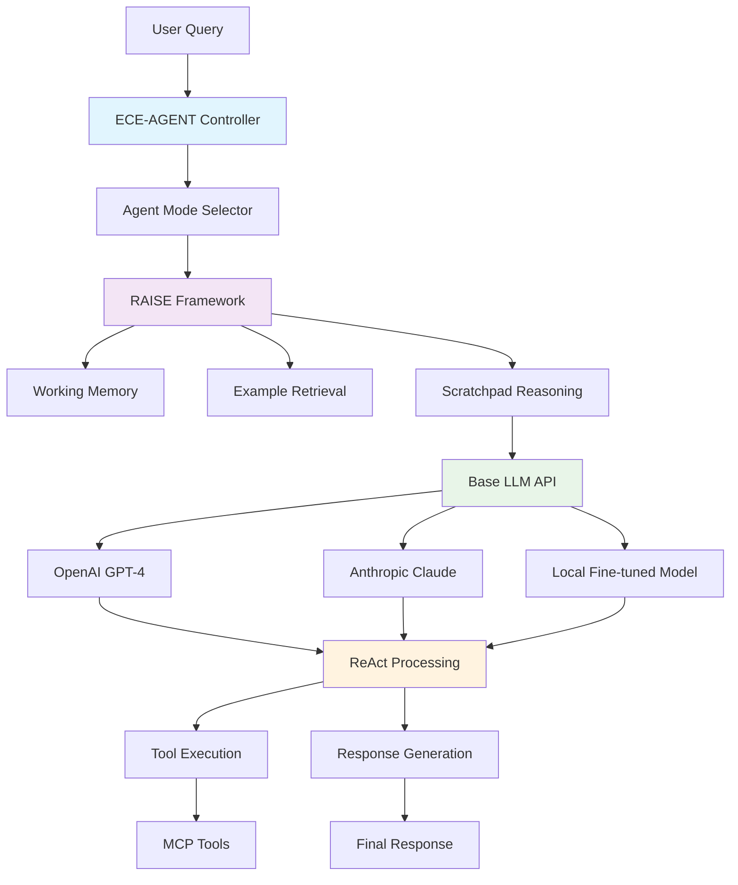

# ECE-AGENT Hybrid LLM Architecture

## Recommended Implementation Strategy

Instead of training a completely custom LLM from scratch, we'll implement a **hybrid architecture** that combines existing powerful models with custom reasoning frameworks.

## Architecture Overview



## Implementation Phases

### Phase 1: API-Based Foundation (Weeks 1-4)
**No training infrastructure needed**

#### 1.1 Base LLM Integration
```typescript
interface BaseLLMProvider {
  openai: OpenAIProvider;
  anthropic: AnthropicProvider;
  local?: LocalModelProvider;
}

class ECEAgentLLM {
  private provider: BaseLLMProvider;
  private raiseController: RAISEController;
  private agentModes: AgentModeManager;
  
  async processQuery(query: string, mode: AgentMode): Promise<AgentResponse> {
    // RAISE framework processing
    const context = await this.raiseController.prepareContext(query, mode);
    
    // ReAct reasoning with base LLM
    const response = await this.executeReActCycle(context);
    
    return response;
  }
}
```

#### 1.2 Required Infrastructure
- **Compute**: Standard cloud instance (4-8 vCPUs, 16-32GB RAM)
- **Storage**: 100GB for examples, traces, and cache
- **APIs**: OpenAI and Anthropic API keys
- **Database**: Extend existing Supabase with vector support

### Phase 2: Custom Reasoning Layer (Weeks 5-8)
**Build sophisticated reasoning on top of base models**

#### 2.1 ReAct Implementation
```typescript
class ReActProcessor {
  async executeReActCycle(context: AgentContext): Promise<AgentResponse> {
    // Observation
    const observation = await this.observe(context);
    
    // Reasoning (with scratchpad)
    const reasoning = await this.reason(observation, context.mode);
    
    // Action
    const action = await this.act(reasoning);
    
    return action;
  }
  
  private async reason(observation: Observation, mode: AgentMode): Promise<Reasoning> {
    const scratchpad = await this.generateScratchpad(observation, mode);
    const examples = await this.retrieveExamples(observation, mode);
    
    return this.baseLLM.reason({
      observation,
      scratchpad,
      examples,
      mode_prompt: this.getModePrompt(mode)
    });
  }
}
```

#### 2.2 Specialized Agent Modes
```typescript
const AGENT_MODE_PROMPTS = {
  smart_assistant: `You are a Smart Assistant. Use ReAct reasoning:
    1. Observe the user's request and context
    2. Think through the best approach step-by-step
    3. Take action using available tools or provide direct answers`,
    
  code_companion: `You are a Code Companion. Use ReAct reasoning:
    1. Observe the code, error, or development task
    2. Analyze the problem and plan debugging/implementation steps
    3. Execute code analysis tools or provide solutions`,
    
  creative_writer: `You are a Creative Writer. Use ReAct reasoning:
    1. Observe the creative brief and requirements
    2. Plan the narrative structure and creative approach
    3. Generate content or provide creative guidance`,
    
  legal_assistant: `You are a Legal Assistant. Use ReAct reasoning:
    1. Observe the legal question or document
    2. Analyze legal implications and research requirements
    3. Provide legal analysis or compliance guidance`,
    
  designer_agent: `You are a Designer Agent. Use ReAct reasoning:
    1. Observe the design requirements and constraints
    2. Plan the design approach and visual hierarchy
    3. Create designs or provide design feedback`
};
```

### Phase 3: Fine-tuning Layer (Weeks 9-12)
**Optional: Add fine-tuned models for specific tasks**

#### 3.1 Selective Fine-tuning
- Fine-tune smaller models (7B-13B parameters) for specific agent modes
- Use LoRA/QLoRA for efficient fine-tuning
- Focus on reasoning patterns and tool usage

#### 3.2 Infrastructure for Fine-tuning
```bash
# Minimal fine-tuning setup
# Single A100 or 4x RTX 4090
# 500GB storage for datasets and checkpoints
# Use Hugging Face Transformers + PEFT
```

## Database Schema

### RAISE Framework Tables
```sql
-- Example storage for retrieval
CREATE TABLE agent_examples (
    id UUID PRIMARY KEY DEFAULT gen_random_uuid(),
    agent_mode VARCHAR(50) NOT NULL,
    query_embedding VECTOR(1536), -- OpenAI embeddings
    query_text TEXT NOT NULL,
    reasoning_trace JSONB,
    tool_calls JSONB,
    response_text TEXT NOT NULL,
    success_rating INTEGER CHECK (success_rating >= 1 AND success_rating <= 5),
    created_at TIMESTAMP WITH TIME ZONE DEFAULT NOW()
);

-- Working memory for sessions
CREATE TABLE working_memory (
    session_id UUID PRIMARY KEY,
    agent_mode VARCHAR(50) NOT NULL,
    conversation_history JSONB,
    scratchpad TEXT,
    retrieved_examples JSONB,
    context_data JSONB,
    updated_at TIMESTAMP WITH TIME ZONE DEFAULT NOW()
);

-- Reasoning traces for learning
CREATE TABLE reasoning_traces (
    id UUID PRIMARY KEY DEFAULT gen_random_uuid(),
    session_id UUID REFERENCES working_memory(session_id),
    step_number INTEGER NOT NULL,
    step_type VARCHAR(20) NOT NULL, -- 'observe', 'reason', 'act'
    content TEXT NOT NULL,
    metadata JSONB,
    created_at TIMESTAMP WITH TIME ZONE DEFAULT NOW()
);
```

## Cost Analysis

### Option 1: API-Only Approach
- **Monthly API costs**: $500-2000 (depending on usage)
- **Infrastructure**: $100-300/month (cloud hosting)
- **Total**: $600-2300/month

### Option 2: Hybrid with Fine-tuning
- **Initial fine-tuning**: $1000-5000 (one-time)
- **Monthly API costs**: $200-800 (reduced usage)
- **Infrastructure**: $300-800/month (GPU instances)
- **Total**: $500-1600/month after initial investment

## Development Timeline

### Immediate Start (This Week)
1. Set up development environment
2. Implement base LLM wrapper
3. Create database schema
4. Build basic ReAct processor

### Week 2-4
1. Implement RAISE controller
2. Add agent mode switching
3. Build example retrieval system
4. Create scratchpad functionality

### Week 5-8
1. Integrate with existing Next.js frontend
2. Add comprehensive testing
3. Implement monitoring and analytics
4. Optimize performance

## Advantages of This Approach

1. **Fast Development**: Start building immediately with APIs
2. **Cost Effective**: No massive training infrastructure
3. **Scalable**: Can add fine-tuning later
4. **Flexible**: Easy to switch between different base models
5. **Practical**: Leverages existing powerful models

## Next Steps

1. **Set up API keys** for OpenAI and Anthropic
2. **Extend Supabase** with vector support for embeddings
3. **Implement base LLM wrapper** with mode switching
4. **Build ReAct processor** with scratchpad functionality
5. **Create RAISE controller** for orchestration

This approach allows us to start building the custom ECE-AGENT immediately while keeping infrastructure costs manageable and maintaining the flexibility to add more sophisticated training later.
