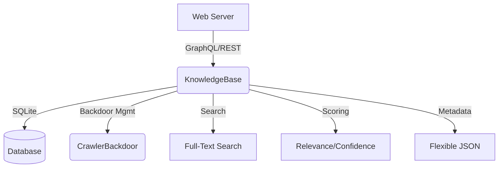

# Knowledge Base Architecture

- **GraphQL/REST**: Unified API for queries and mutations
- **SQLite**: Persistent, async storage for all knowledge entries
- **CrawlerBackdoor**: Soft retraining endpoints for crawlers
- **Full-Text Search**: Title/content search with ranking
- **Relevance/Confidence**: Automated scoring for results
- **Flexible Metadata**: Extensible JSON for future features
