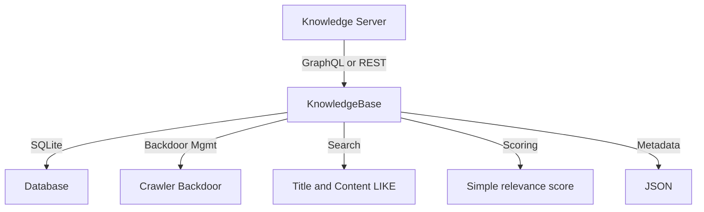

# Knowledge Base Architecture

Notes and implementation anchors

- Knowledge Server: FastAPI service serving KnowledgeBase over GraphQL and REST
  - Server: [agent/knowledge_server.py](agent/knowledge_server.py)
  - Endpoints:
    - GraphQL: POST /graphql in [agent/knowledge_server.py](agent/knowledge_server.py)
    - REST search: GET /knowledge/search in [agent/knowledge_server.py](agent/knowledge_server.py)
    - REST entries: GET or POST /knowledge/entries in [agent/knowledge_server.py](agent/knowledge_server.py)
- Knowledge Base engine and schema
  - Engine: [agent/core/knowledge_base_v2.py](agent/core/knowledge_base_v2.py)
  - Storage: SQLite file created at runtime
  - Search: SQL LIKE on title and content with an internal simple relevance_score computation
  - Backdoor management: soft backdoors with activation and audit fields
  - GraphQL schema: exposed if graphene is available, see knowledge_schema in [agent/core/knowledge_base_v2.py](agent/core/knowledge_base_v2.py)
- Usage in system
  - Orchestrators access KnowledgeBase via Knowledge Server endpoints for queries and CRUD
  - EnhancedAgent uses KnowledgeBase for knowledge operations indirectly through services

Implemented behavior summary

- SQLite persistence with async access through aiosqlite
- Title and content search using SQL LIKE combined with a simple relevance and confidence based score
- CRUD operations for entries with JSON metadata and tags
- Soft crawler backdoor creation, access tracking, and deactivation
- GraphQL and REST APIs provided by the Knowledge Server

Roadmap

- Add vector index or full text search index alongside SQL LIKE for improved recall and ranking
- Expand GraphQL schema coverage and add mutations for backdoor lifecycle and bulk operations
- Add rate limiting and auth middleware to Knowledge Server endpoints
- Introduce background reindex and analytics tasks for usage based optimization

