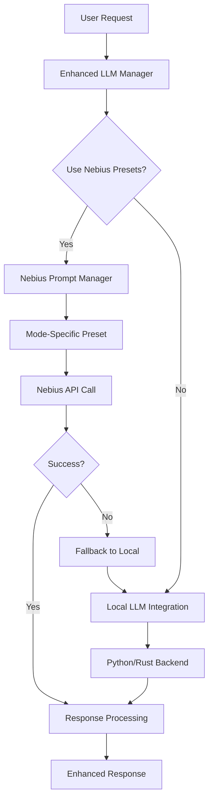

# AGENT LLM Self-Care Architecture

## Overview

The AGENT LLM system implements a sophisticated self-care architecture based on the RAISE framework (Reasoning, Acting, Iterating, Synthesizing, Evaluating) with robust multi-language backend connections for optimal performance and knowledge management.

## Architecture Components

### 1. Nebius Prompt Presets Integration

#### Nebius AI Studio API
- **Prompt Management**: Centralized prompt preset creation and management
- **Model Selection**: Access to multiple LLM models (DeepSeek-V3, Llama-3.3-70B)
- **Mode-Specific Presets**: Specialized prompts for each training data mode
- **Dynamic Configuration**: Real-time prompt optimization and A/B testing

#### Enhanced LLM Manager
- **Hybrid Processing**: Combines Nebius presets with local backend processing
- **Intelligent Fallback**: Automatic fallback to local processing when needed
- **Preset Caching**: Efficient caching of frequently used prompt presets
- **Auto-Creation**: Automatic creation of default presets for all modes

### 2. RAISE Framework Integration

#### Reasoning Component
- **System Prompt Management**: Dynamic prompt generation based on context and task requirements
- **Working Memory**: Maintains conversation history, scratchpad, and retrieved examples
- **Task Trajectory**: Tracks reasoning steps and decision points

#### Acting Component
- **Tool Pool Integration**: Database access, scripting, programming tools, knowledge bases
- **Action Execution**: Controlled execution environment with safety measures
- **Observation Processing**: Real-time feedback and result analysis

#### Iterating Component
- **Agent Loop**: Continuous task plan → generate response → use tools → retrieve examples cycle
- **Edit Working Memory**: Dynamic memory management and context updates
- **Get Outside Reaction**: External validation and feedback integration

#### Synthesizing Component
- **Example Pool Management**: Query-answer pairs with contextual relevance
- **Knowledge Integration**: Seamless integration with cybersecurity and domain knowledge
- **Response Generation**: Context-aware response synthesis

#### Evaluating Component
- **Performance Monitoring**: Real-time assessment of reasoning quality
- **Self-Correction**: Automatic error detection and correction mechanisms
- **Learning Integration**: Continuous improvement from interactions

### 2. Backend Architecture

#### Python Backend Layer
```python
# Connection Management
class LLMConnectionManager:
    def __init__(self):
        self.connection_pool = ConnectionPool(max_connections=10)
        self.retry_policy = ExponentialBackoff(max_retries=3)
        
    async def execute_query(self, query: str) -> Dict:
        """Execute LLM query with connection pooling and error handling"""
        
    async def manage_knowledge_base(self, operation: str, data: Dict) -> Dict:
        """Manage knowledge base operations with robust error handling"""
```

#### Rust Backend Layer
```rust
// High-performance LLM processing
pub struct LLMProcessor {
    pub config: LLMConfig,
    pub performance_monitor: PerformanceMonitor,
}

impl LLMProcessor {
    pub async fn process_request(&self, request: LLMRequest) -> Result<LLMResponse> {
        // High-performance request processing
    }
    
    pub async fn optimize_memory(&self) -> Result<()> {
        // Memory optimization and garbage collection
    }
}
```

### 3. Knowledge Base Integration

#### Connection Layer Architecture
```
┌─────────────────────────────────────────────────────────────┐
│                    Frontend (React/Nx)                     │
├─────────────────────────────────────────────────────────────┤
│                  API Gateway Layer                         │
├─────────────────────────────────────────────────────────────┤
│         Python Backend          │      Rust Backend        │
│    ┌─────────────────────────┐   │  ┌─────────────────────┐ │
│    │   LLM Manager           │   │  │  Performance Core   │ │
│    │   Knowledge Base API    │   │  │  Memory Manager     │ │
│    │   WebSocket Handler     │   │  │  Query Optimizer    │ │
│    └─────────────────────────┘   │  └─────────────────────┘ │
├─────────────────────────────────────────────────────────────┤
│                  Knowledge Base Layer                      │
│    ┌─────────────────────────────────────────────────────┐ │
│    │  SQLite DB  │  Vector Store  │  Document Index    │ │
│    └─────────────────────────────────────────────────────┘ │
└─────────────────────────────────────────────────────────────┘
```

### 4. Self-Care Mechanisms

#### Health Monitoring
- **Connection Health**: Monitor backend connection status
- **Performance Metrics**: Track response times, error rates, memory usage
- **Resource Management**: Automatic cleanup and optimization

#### Auto-Recovery
- **Connection Retry**: Automatic reconnection with exponential backoff
- **Graceful Degradation**: Fallback mechanisms for service interruptions
- **State Recovery**: Restore working memory and context after failures

#### Optimization
- **Query Caching**: Intelligent caching of frequent queries
- **Memory Management**: Automatic memory cleanup and optimization
- **Performance Tuning**: Dynamic adjustment of processing parameters

## Implementation Details

### Python Backend (`agent/llm_manager.py`)
```python
import asyncio
import logging
from typing import Dict, List, Optional
from dataclasses import dataclass
from contextlib import asynccontextmanager

@dataclass
class LLMConfig:
    model_name: str
    max_tokens: int
    temperature: float
    connection_timeout: int
    retry_attempts: int

class LLMSelfCareManager:
    def __init__(self, config: LLMConfig):
        self.config = config
        self.health_monitor = HealthMonitor()
        self.performance_tracker = PerformanceTracker()
        
    async def process_with_self_care(self, request: Dict) -> Dict:
        """Process request with full self-care monitoring"""
        async with self.health_monitor.track_request():
            try:
                return await self._process_request(request)
            except Exception as e:
                await self._handle_error(e)
                return await self._fallback_response(request)
```

### Rust Backend (`rust/src/llm_core.rs`)
```rust
use tokio::sync::RwLock;
use std::sync::Arc;
use serde::{Deserialize, Serialize};

#[derive(Debug, Clone, Serialize, Deserialize)]
pub struct LLMRequest {
    pub query: String,
    pub context: Vec<String>,
    pub max_tokens: Option<u32>,
}

pub struct LLMCore {
    config: Arc<RwLock<LLMConfig>>,
    performance_monitor: Arc<PerformanceMonitor>,
    memory_manager: Arc<MemoryManager>,
}

impl LLMCore {
    pub async fn new(config: LLMConfig) -> Result<Self, LLMError> {
        Ok(Self {
            config: Arc::new(RwLock::new(config)),
            performance_monitor: Arc::new(PerformanceMonitor::new()),
            memory_manager: Arc::new(MemoryManager::new()),
        })
    }
    
    pub async fn process_optimized(&self, request: LLMRequest) -> Result<LLMResponse, LLMError> {
        // High-performance processing with memory optimization
        self.memory_manager.optimize().await?;
        self.performance_monitor.start_tracking().await;
        
        // Process request with full monitoring
        let result = self.internal_process(request).await;
        
        self.performance_monitor.end_tracking().await;
        result
    }
}
```

## Configuration Management

### Model Configuration (`config/llm_config.yaml`)
```yaml
llm:
  primary_model: "gpt-4"
  fallback_model: "gpt-3.5-turbo"
  max_tokens: 4096
  temperature: 0.7
  
backends:
  python:
    host: "localhost"
    port: 8000
    timeout: 30
    pool_size: 10
    
  rust:
    host: "localhost"
    port: 8001
    timeout: 15
    workers: 4

knowledge_base:
  database_path: "./cybersec_knowledge.db"
  vector_store_path: "./vectors/"
  index_refresh_interval: 3600
```

## Performance Optimization

### Caching Strategy
- **Query Result Caching**: Cache frequent query results
- **Context Caching**: Cache processed contexts for reuse
- **Model Response Caching**: Cache model responses for identical inputs

### Memory Management
- **Automatic Cleanup**: Regular cleanup of unused memory
- **Context Window Management**: Intelligent context truncation
- **Resource Monitoring**: Real-time resource usage tracking

### Load Balancing
- **Backend Distribution**: Distribute load between Python and Rust backends
- **Request Queuing**: Intelligent request queuing and prioritization
- **Adaptive Scaling**: Dynamic scaling based on load

## Monitoring and Observability

### Metrics Collection
- Response time percentiles (p50, p95, p99)
- Error rates and types
- Memory usage patterns
- Connection pool utilization

### Health Checks
- Backend connectivity status
- Database connection health
- Model availability and performance
- Resource utilization thresholds

### Alerting
- Performance degradation alerts
- Error rate threshold alerts
- Resource exhaustion warnings
- Connection failure notifications

## Security Considerations

### Data Protection
- Encrypt sensitive data in transit and at rest
- Implement proper authentication and authorization
- Sanitize inputs to prevent injection attacks

### Access Control
- Role-based access to different LLM capabilities
- Rate limiting to prevent abuse
- Audit logging for all operations

### Privacy
- Data anonymization where appropriate
- Compliance with privacy regulations
- Secure handling of user data

## Nebius Integration Architecture

### Prompt Preset Management

The AGENT system integrates with Nebius AI Studio for advanced prompt management:



### Mode-Specific Processing

Each training data mode has specialized prompt presets:

- **Design Mode**: UI/UX and 3D design optimization prompts
- **Security Mode**: Cybersecurity analysis and threat assessment prompts  
- **Development Mode**: Code generation and architecture design prompts
- **Analysis Mode**: Data analysis and business intelligence prompts
- **Communication Mode**: Technical writing and documentation prompts
- **Automation Mode**: Process optimization and workflow prompts
- **Research Mode**: Information synthesis and knowledge gathering prompts
- **Reasoning Mode**: Logical analysis and problem-solving prompts
- **Creative Mode**: Content creation and artistic generation prompts
- **Educational Mode**: Teaching and knowledge transfer prompts
- **Diagnostic Mode**: Problem identification and troubleshooting prompts
- **Optimization Mode**: Performance tuning and efficiency prompts

### Configuration Management

The system uses YAML-based configuration for flexible deployment:

```yaml
nebius:
  use_nebius_presets: true
  fallback_to_local: true
  auto_create_presets: true
  mode_models:
    design: "deepseek-ai/DeepSeek-V3-0324-fast"
    security: "meta-llama/Llama-3.3-70B-Instruct"
```

### Performance Optimization

- **Preset Caching**: Frequently used presets cached locally (1-hour TTL)
- **Intelligent Fallback**: Automatic fallback to local processing on API failures
- **Load Balancing**: Distributes requests between Nebius and local backends
- **Response Validation**: Quality assurance with minimum confidence scoring

## Future Enhancements

### Planned Features
- **Advanced Reasoning Chains**: Multi-step reasoning with intermediate validation
- **Dynamic Model Selection**: Automatic model selection based on task complexity
- **Federated Learning**: Distributed training across multiple nodes
- **Real-time Adaptation**: Dynamic prompt and parameter adjustment
- **Enhanced Security**: Advanced encryption and access control
- **Multi-modal Support**: Integration with vision and audio models
- **Nebius A/B Testing**: Automated prompt optimization through A/B testing
- **Custom Model Training**: Fine-tuning models on specialized training data

### Research Areas
- **Quantum-inspired Algorithms**: Exploration of quantum computing principles
- **Neuromorphic Computing**: Brain-inspired processing architectures
- **Explainable AI**: Enhanced interpretability and reasoning transparency
- **Ethical AI**: Bias detection and fairness optimization
- **Prompt Engineering**: Advanced prompt optimization techniques

## Conclusion

The AGENT LLM Self-Care Architecture provides a robust, scalable, and intelligent foundation for advanced AI agent operations. By implementing the RAISE framework with multi-language backend support and comprehensive self-monitoring, the system ensures optimal performance, reliability, and continuous improvement.
