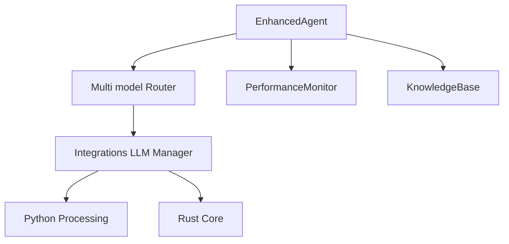

# AGENT LLM Self-Care Architecture

## Overview

This document reflects the current implementation of LLM orchestration and self-care mechanisms in the AGENT system. It corrects file paths and focuses on implemented capabilities, with planned features tracked in the Roadmap.

## Current Architecture

Notes and implementation anchors

- Enhanced Agent and Core
  - Core orchestrator: [agent/core/core.py](agent/core/core.py)
  - Enhanced orchestrator: [agent/core/enhanced_agent.py](agent/core/enhanced_agent.py)
- LLM Integrations
  - Python LLM Manager: [agent/integrations/llm_manager.py](agent/integrations/llm_manager.py)
  - Rust LLM Core: [rust/src/llm_core.rs](rust/src/llm_core.rs)
- Monitoring and self-care signals
  - Performance monitoring: [agent/integrations/performance_monitor.py](agent/integrations/performance_monitor.py)
  - Knowledge operations: [agent/core/knowledge_base_v2.py](agent/core/knowledge_base_v2.py) via [agent/knowledge_server.py](agent/knowledge_server.py)

Implemented mechanisms

- Reasoning and planning
  - EnhancedAgent provides reasoning types and planning execution with memory and tool registry: [agent/core/enhanced_agent.py](agent/core/enhanced_agent.py)
- Multi model routing
  - Queries routed through integrations and enhanced processing in EnhancedAgent
- Self monitoring
  - PerformanceMonitor collects system metrics and exposes summaries: [agent/integrations/performance_monitor.py](agent/integrations/performance_monitor.py)
- Knowledge integration
  - KnowledgeBase provides async SQLite storage and GraphQL or REST access via Knowledge Server

Roadmap

- Nebius prompt preset management and dynamic model selection
- YAML based configuration surface for model and backend routing
- Advanced load balancing between Python and Rust backends
- Expanded self healing logic with retry policies and graceful degradation paths
- Confidence scoring loops with response validation gates
