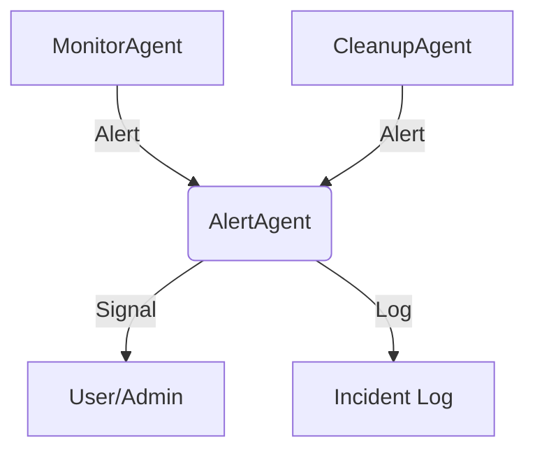

# Maintenance Agents Architecture

- **MonitorAgent**: Checks system health, triggers alerts if thresholds exceeded
- **CleanupAgent**: Standardizes files/folders, removes temp files, triggers alerts if needed
- **AlertAgent**: Sends alerts to logs, stdout, or external systems
- **No infinite loops**: Agents run once and exit, emitting signals/alerts
- **Signals, not loops**: Designed for automation, not persistent daemons
