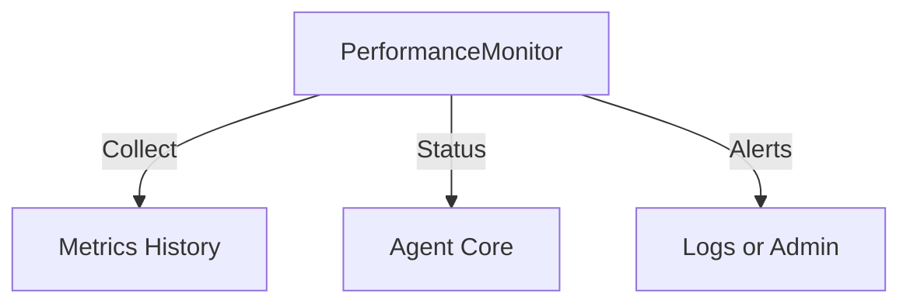

# Maintenance and Monitoring Architecture

Notes and implementation anchors

- Performance monitoring module: [agent/integrations/performance_monitor.py](agent/integrations/performance_monitor.py)
  - Periodic collection of CPU, memory, IO, network, and process metrics
  - Summaries and health assessment with simple alert generation
- Agent integration
  - Status and metrics can be consumed by orchestrators in [agent/core/core.py](agent/core/core.py) and [agent/core/enhanced_agent.py](agent/core/enhanced_agent.py)

Current behavior

- Async monitoring loop with bounded history
- Summary endpoints for recent windows of time
- Basic alerting via returned status fields and logs

Roadmap

- One shot Cleanup agent for temp files and workspace hygiene
- One shot Alert agent for emitting notifications to external systems
- One shot Monitor agent for targeted checks
- Pluggable thresholds and destinations for alerts
