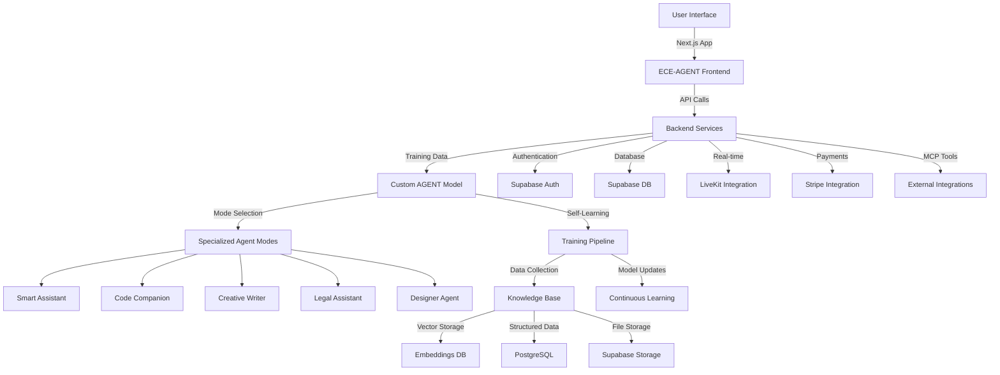

# AGENT System Architecture Overview

---

## Implementation Architecture

### Frontend Layer
- **Next.js Application**: React-based UI with TypeScript and Tailwind CSS
- **Authentication**: Supabase Auth with OAuth providers (Google, Solana wallet)
- **Real-time Communication**: LiveKit for video/audio calls
- **State Management**: React hooks and context providers
- **API Testing**: Comprehensive testing interface at `/test`

### Backend Services
- **API Routes**: Next.js API routes for backend functionality
- **Database**: Supabase PostgreSQL with Row Level Security
- **File Storage**: Supabase Storage for media and documents
- **Payments**: Stripe integration for credits and subscriptions
- **MCP Integration**: GitHub and other external tool integrations

### Custom AGENT Model Architecture
- **Base Model**: Custom-trained foundation model
- **Specialized Modes**: Five distinct agent personalities with specialized training
- **Context Switching**: Dynamic mode selection based on user intent
- **Memory System**: Persistent conversation context and user preferences

### Self-Learning Pipeline
- **Data Collection**: Conversation logs, user feedback, performance metrics
- **Training Updates**: Continuous fine-tuning with relevant domain data
- **Model Versioning**: Staged rollouts of improved model versions
- **Quality Assurance**: Automated testing and human review of model outputs

## Specialized Agent Modes

### 1. Smart Assistant
- **Purpose**: General AI helper for everyday tasks
- **Capabilities**: Scheduling, reminders, general knowledge, task management
- **Training Data**: Broad general knowledge, productivity workflows

### 2. Code Companion  
- **Purpose**: Programming and development assistance
- **Capabilities**: Code generation, debugging, architecture advice, code review
- **Training Data**: GitHub repositories, documentation, coding best practices

### 3. Creative Writer
- **Purpose**: Content creation and writing assistance
- **Capabilities**: Articles, stories, marketing copy, editing, style guidance
- **Training Data**: Literature, journalism, marketing materials, writing guides

### 4. Legal Assistant
- **Purpose**: Legal research and document analysis
- **Capabilities**: Contract review, legal research, compliance guidance
- **Training Data**: Legal documents, case law, regulations, legal precedents

### 5. Designer Agent
- **Purpose**: Design consultation and creative direction
- **Capabilities**: UI/UX advice, design systems, visual hierarchy, accessibility
- **Training Data**: Design patterns, style guides, accessibility standards

## Current Implementation Status

- ✅ Frontend architecture with Next.js and Supabase
- ✅ Authentication and user management
- ✅ Basic chat interface with agent selection
- ✅ API testing infrastructure
- 🔄 Custom model training pipeline (in development)
- 🔄 Specialized mode implementations (in development)
- 🔄 Self-learning mechanisms (planned)

## Roadmap

- **Phase 1**: Complete specialized agent mode implementations
- **Phase 2**: Deploy custom AGENT model with initial training
- **Phase 3**: Implement self-learning pipeline with continuous updates
- **Phase 4**: Advanced features like multi-modal inputs and collaborative agents
