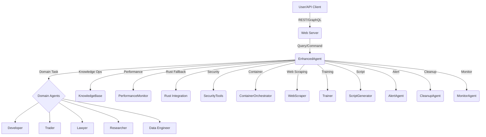

# AGENT System Architecture Overview

---

- **Web Server**: FastAPI-based, exposes REST and GraphQL endpoints
- **EnhancedAgent**: Core orchestrator, routes tasks to domain agents and tools
- **Domain Agents**: Specialized agents for developer, trader, lawyer, etc.
- **KnowledgeBase**: Async SQLite + GraphQL, stores and retrieves knowledge
- **PerformanceMonitor**: Tracks system health and resource usage
- **Rust Integration**: High-performance fallback for critical operations
- **SecurityTools**: Security and compliance utilities
- **ContainerOrchestrator**: Manages isolated environments
- **WebScraper**: Gathers external data
- **Trainer**: Handles training data and model updates
- **ScriptGenerator**: Generates and executes scripts
- **AlertAgent/CleanupAgent/MonitorAgent**: Maintenance and incident response
