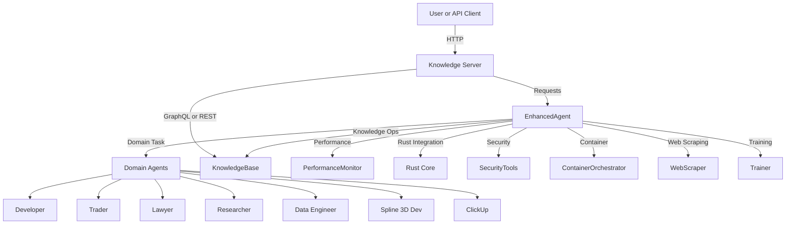

# AGENT System Architecture Overview

---

Notes and implementation anchors

- Web Server: FastAPI service at [agent/knowledge_server.py](agent/knowledge_server.py)
- Orchestrators:
  - Core: [agent/core/core.py](agent/core/core.py)
  - Enhanced: [agent/core/enhanced_agent.py](agent/core/enhanced_agent.py)
- Domain Agents:
  - [agent/domains/developer.py](agent/domains/developer.py)
  - [agent/domains/trader.py](agent/domains/trader.py)
  - [agent/domains/lawyer.py](agent/domains/lawyer.py)
  - [agent/domains/researcher.py](agent/domains/researcher.py)
  - [agent/domains/data_engineer.py](agent/domains/data_engineer.py)
  - [agent/domains/spline_3d_developer.py](agent/domains/spline_3d_developer.py)
  - [agent/domains/clickup.py](agent/domains/clickup.py)
  - Aliases for security roles are mapped to Researcher in [agent/domains/__init__.py](agent/domains/__init__.py)
- Knowledge Base:
  - Engine: [agent/core/knowledge_base_v2.py](agent/core/knowledge_base_v2.py)
  - Endpoints: GraphQL and REST in [agent/knowledge_server.py](agent/knowledge_server.py)
- Performance Monitor: [agent/integrations/performance_monitor.py](agent/integrations/performance_monitor.py)
- Rust Integration:
  - LLM Core: [rust/src/llm_core.rs](rust/src/llm_core.rs)
- Security Tools: [agent/security_tools.py](agent/security_tools.py)
- Container Orchestrator: [agent/container_orchestrator.py](agent/container_orchestrator.py)
- Web Scraper: [agent/web_scraper.py](agent/web_scraper.py)
- Trainer: [agent/trainer.py](agent/trainer.py)

Implemented components summary

- Knowledge Server exposes GraphQL or REST endpoints for the KnowledgeBase.
- EnhancedAgent wraps AGENTCore and provides planning, memory, and multi model routing integration.
- Domain agents implemented include Developer, Trader, Lawyer, Researcher, Data Engineer, Spline 3D Dev, and ClickUp.
- KnowledgeBase uses SQLite with SQL LIKE search and a simple relevance score.
- Performance monitoring is provided by PerformanceMonitor.
- Rust core exists for high performance operations and integrations.
- Supporting modules include SecurityTools, ContainerOrchestrator, WebScraper, and Trainer.

Roadmap

- Dedicated ScriptGenerator, AlertAgent, CleanupAgent, MonitorAgent as one shot maintenance utilities connected to orchestration signals.
- Vector or full text indexing for KnowledgeBase in addition to SQL LIKE search.
- Consolidate knowledge and orchestration endpoints behind a unified application gateway when appropriate.
