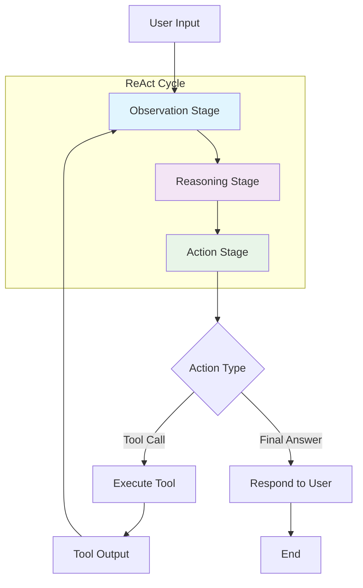
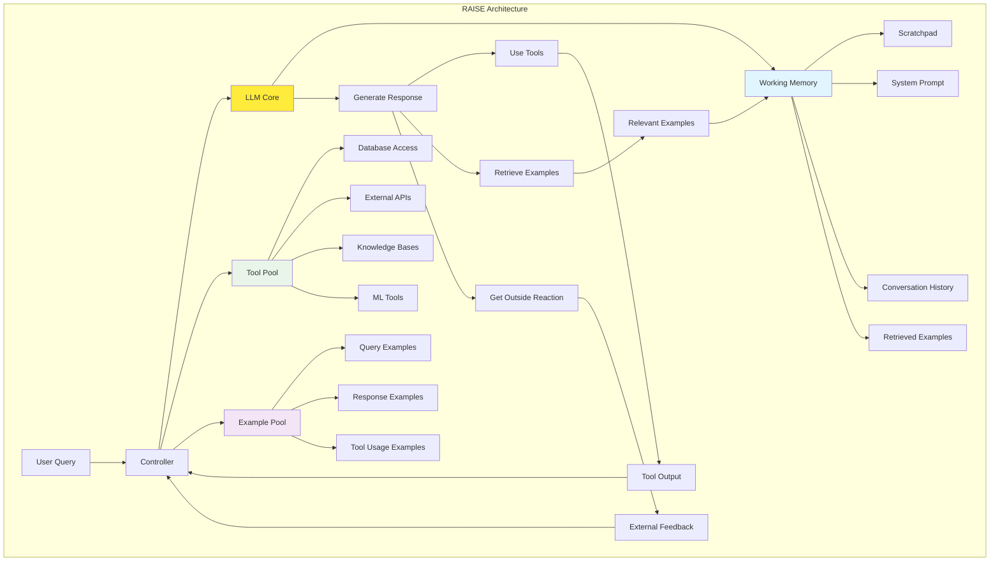
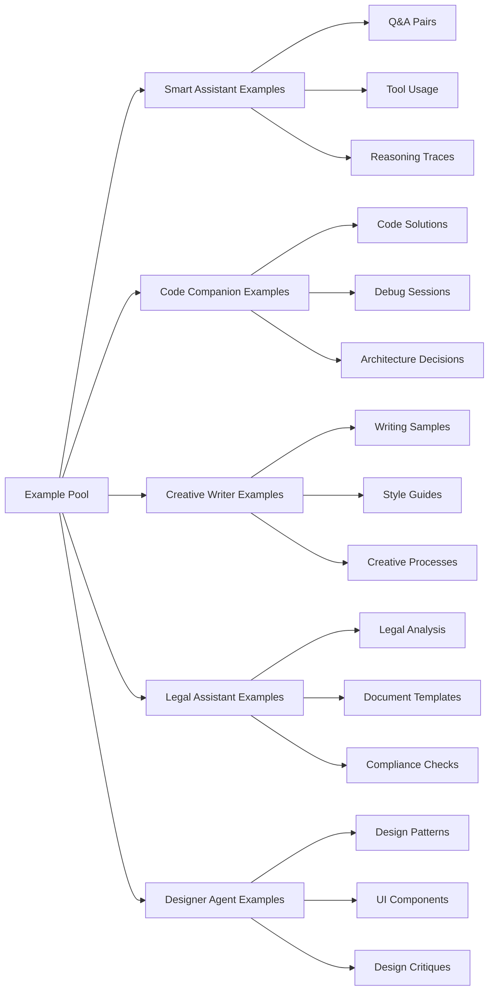
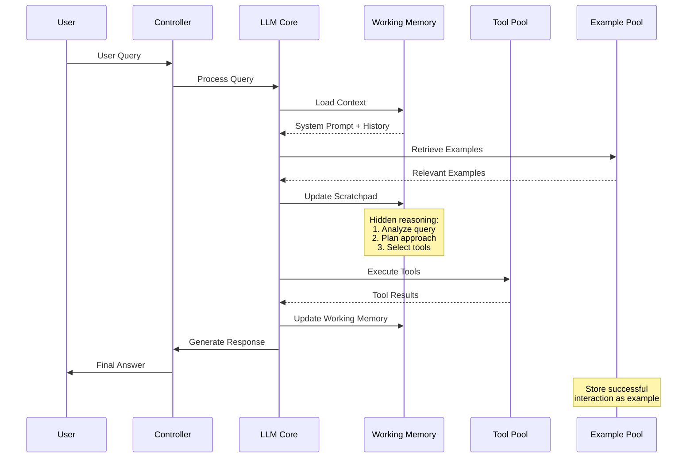
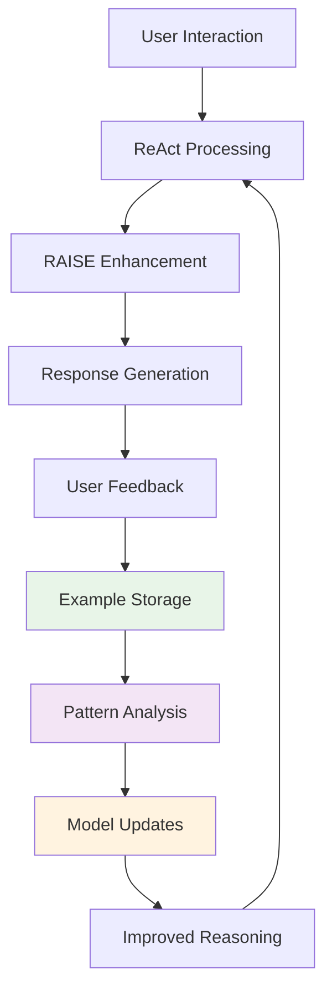

# ECE-AGENT Reasoning Frameworks

This document outlines the integration of ReAct and RAISE frameworks into the ECE-AGENT custom LLM architecture to enhance reasoning, planning, and decision-making capabilities across all specialized agent modes.

## ReAct Framework Integration

The ReAct (Reason + Act) framework provides a structured approach to agent reasoning through three core stages:



### ReAct Implementation by Agent Mode

#### Smart Assistant Mode
- **Observation**: Analyzes user queries, conversation context, and available tools
- **Reasoning**: Determines optimal response strategy and tool selection
- **Action**: Executes tools or provides direct answers

#### Code Companion Mode
- **Observation**: Reviews code context, error messages, and development environment
- **Reasoning**: Plans debugging steps, code improvements, or implementation strategies
- **Action**: Generates code, runs tests, or provides technical guidance

#### Creative Writer Mode
- **Observation**: Understands creative brief, style requirements, and content goals
- **Reasoning**: Plans narrative structure, tone, and creative approach
- **Action**: Generates content, suggests revisions, or provides creative feedback

#### Legal Assistant Mode
- **Observation**: Analyzes legal documents, case law, and regulatory context
- **Reasoning**: Evaluates legal implications and compliance requirements
- **Action**: Provides legal analysis, document drafts, or compliance guidance

#### Designer Agent Mode
- **Observation**: Reviews design requirements, brand guidelines, and user needs
- **Reasoning**: Plans design approach, layout, and visual hierarchy
- **Action**: Creates designs, provides feedback, or suggests improvements

## RAISE Framework Implementation

The RAISE (Reasoning and Acting through Scratchpad and Examples) framework extends ReAct with memory and learning capabilities:



### RAISE Components for ECE-AGENT

#### Working Memory
- **System Prompt**: Role-specific instructions for each agent mode
- **Conversation History**: Context from current and related conversations
- **Scratchpad**: Hidden reasoning and planning space
- **Retrieved Examples**: Relevant examples from the example database

#### Tool Pool Integration
- **MCP Tools**: External integrations via Model Context Protocol
- **Database Access**: Supabase queries for user data and preferences
- **API Integrations**: Stripe, LiveKit, and other service APIs
- **Knowledge Bases**: Domain-specific information repositories

#### Example Pool Structure


## Agent Reasoning Pipeline

### Enhanced Reasoning Process


### Scratchpad Implementation

The scratchpad provides hidden reasoning space for each agent mode:

#### Smart Assistant Scratchpad
```
<thinking>
User is asking about weather in San Francisco and current time.
Plan:
1. Use weather API to get SF current conditions
2. Use timezone API to get Pacific time
3. Combine information in user-friendly format
Tools needed: get_weather, get_time
</thinking>
```

#### Code Companion Scratchpad
```
<thinking>
User has a React component with state management issues.
Analysis:
- Component re-renders unnecessarily
- State updates are not batched
- Missing useMemo for expensive calculations
Plan:
1. Identify performance bottlenecks
2. Suggest React.memo wrapper
3. Recommend useMemo for calculations
4. Show optimized code example
</thinking>
```

## Implementation Architecture

### Database Schema for Examples
```sql
-- Example storage for RAISE framework
CREATE TABLE agent_examples (
    id UUID PRIMARY KEY DEFAULT gen_random_uuid(),
    agent_mode VARCHAR(50) NOT NULL,
    query_text TEXT NOT NULL,
    reasoning_trace TEXT,
    tool_calls JSONB,
    response_text TEXT NOT NULL,
    success_rating INTEGER CHECK (success_rating >= 1 AND success_rating <= 5),
    created_at TIMESTAMP WITH TIME ZONE DEFAULT NOW(),
    updated_at TIMESTAMP WITH TIME ZONE DEFAULT NOW()
);

-- Index for fast retrieval
CREATE INDEX idx_agent_examples_mode ON agent_examples(agent_mode);
CREATE INDEX idx_agent_examples_query ON agent_examples USING gin(to_tsvector('english', query_text));
```

### Controller Implementation
```typescript
interface RAISEController {
  processQuery(query: string, agentMode: AgentMode): Promise<AgentResponse>;
  retrieveExamples(query: string, mode: AgentMode): Promise<Example[]>;
  updateWorkingMemory(context: ConversationContext): void;
  executeTools(toolCalls: ToolCall[]): Promise<ToolResult[]>;
  storeExample(interaction: AgentInteraction): Promise<void>;
}

interface WorkingMemory {
  systemPrompt: string;
  conversationHistory: Message[];
  scratchpad: string;
  retrievedExamples: Example[];
  currentContext: AgentContext;
}
```

## Integration with Self-Learning Pipeline

The RAISE framework enhances the existing self-learning pipeline by:

1. **Example Collection**: Automatically storing successful reasoning traces
2. **Pattern Recognition**: Identifying effective reasoning strategies
3. **Continuous Improvement**: Updating example database with new patterns
4. **Quality Assurance**: Validating reasoning quality through feedback



## Roadmap

### Phase 1: ReAct Integration (Q1 2024)
- Implement basic observation-reasoning-action cycles
- Add scratchpad functionality to all agent modes
- Create reasoning trace logging

### Phase 2: RAISE Framework (Q2 2024)
- Build example database and retrieval system
- Implement working memory management
- Add controller for framework orchestration

### Phase 3: Advanced Reasoning (Q3 2024)
- Multi-step planning capabilities
- Cross-mode reasoning and collaboration
- Advanced pattern recognition and learning

### Phase 4: Optimization (Q4 2024)
- Performance optimization for real-time reasoning
- Advanced example selection algorithms
- Reasoning quality metrics and monitoring

## Monitoring and Metrics

### Reasoning Quality Metrics
- **Reasoning Coherence**: Logical flow in scratchpad traces
- **Tool Selection Accuracy**: Appropriate tool choices for tasks
- **Response Quality**: User satisfaction with agent responses
- **Learning Effectiveness**: Improvement over time with examples

### Performance Metrics
- **Reasoning Latency**: Time from query to response
- **Example Retrieval Speed**: Database query performance
- **Memory Usage**: Working memory efficiency
- **Tool Execution Time**: External API response times

This reasoning framework integration will significantly enhance the ECE-AGENT's ability to provide thoughtful, well-reasoned responses across all specialized modes while continuously learning from interactions.
