# Self-Learning Pipeline Architecture

## Overview

The AGENT model features a sophisticated self-learning pipeline that continuously improves through user interactions, feedback analysis, and automated training updates. This system ensures the model stays current with evolving user needs and domain knowledge.

## Enhanced Self-Learning Pipeline with RAISE Integration

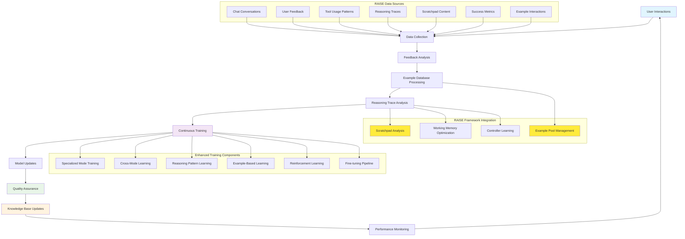

## Data Collection Architecture

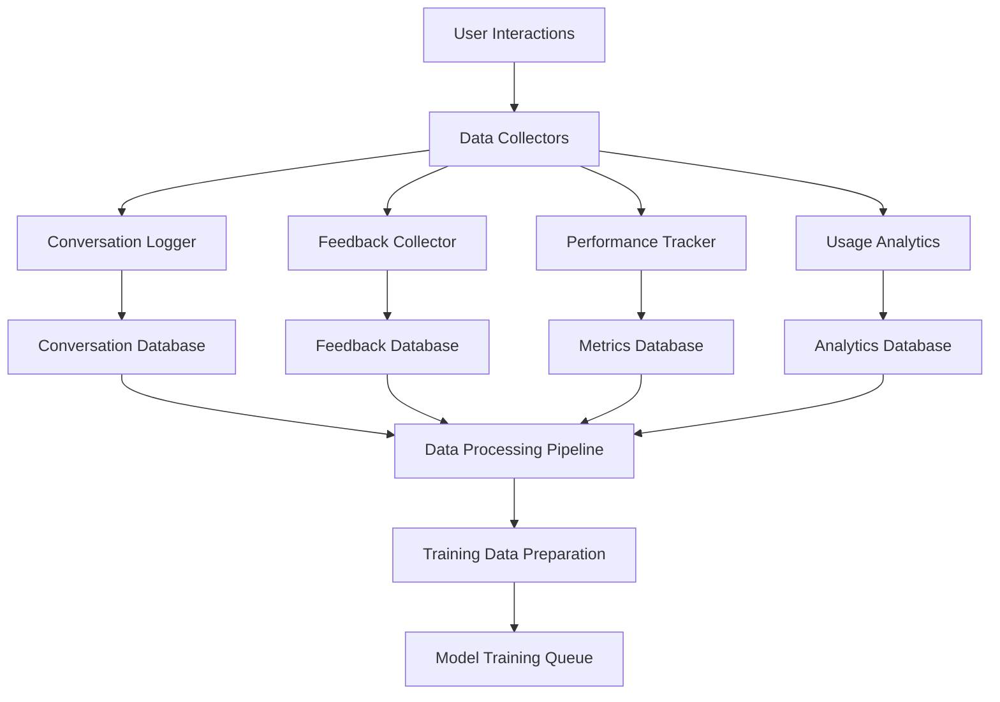

## Training Data Processing

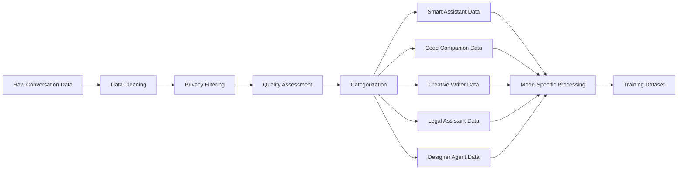

## Feedback Analysis System

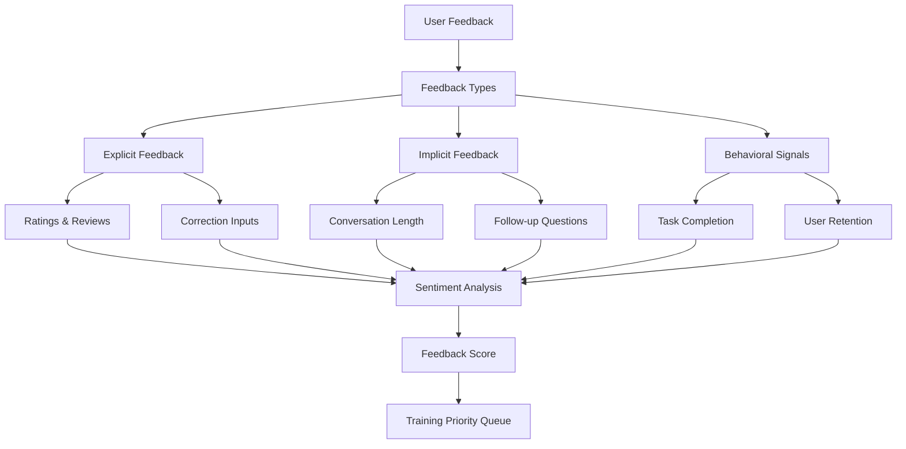

## Continuous Training Pipeline

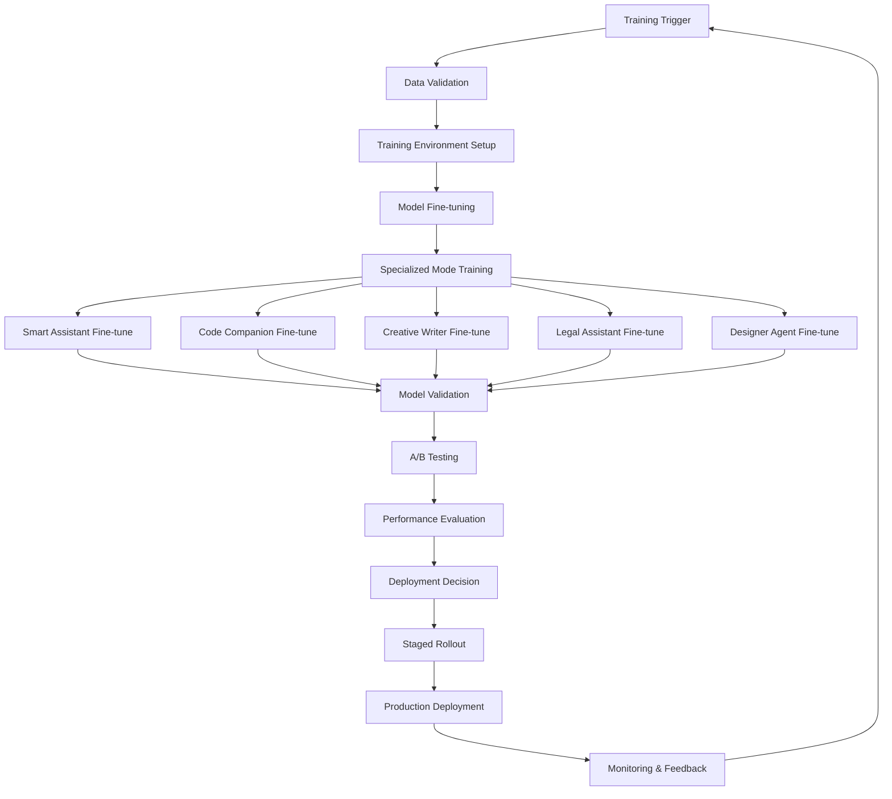

## Knowledge Base Updates

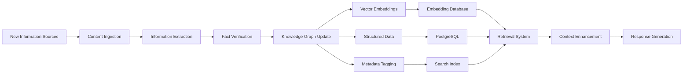

## Quality Assurance Framework

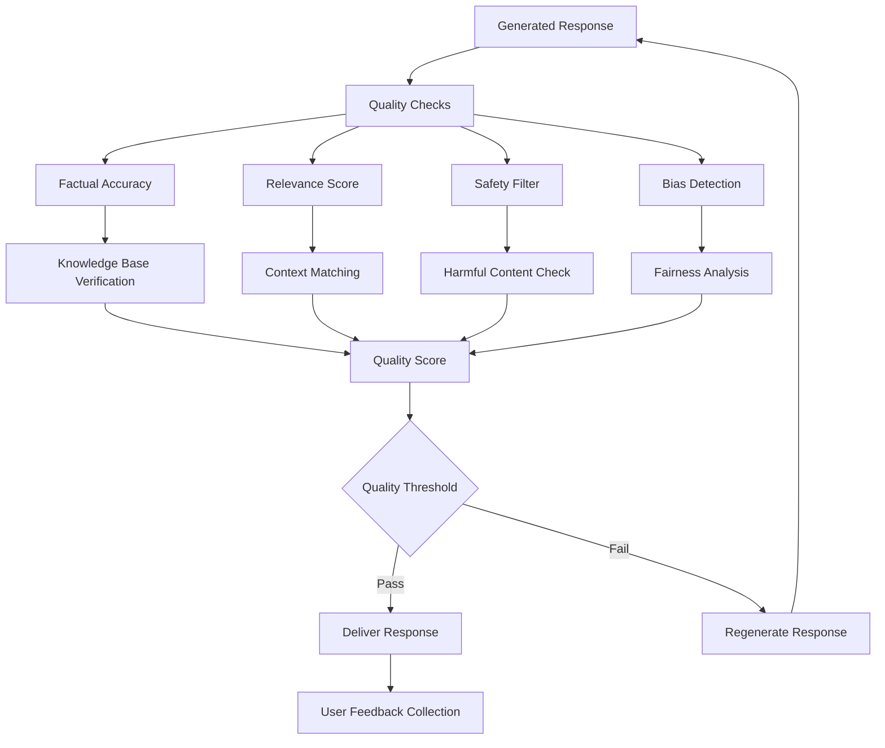

## Training Data Sources by Mode

### Smart Assistant Training Sources
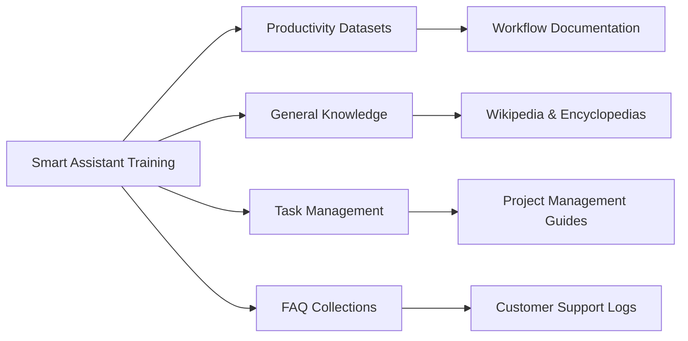

### Code Companion Training Sources
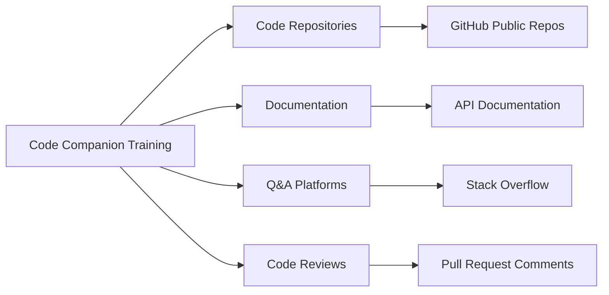

### Creative Writer Training Sources
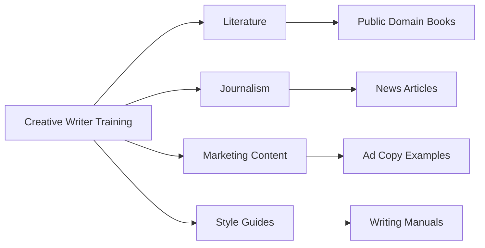

### Legal Assistant Training Sources
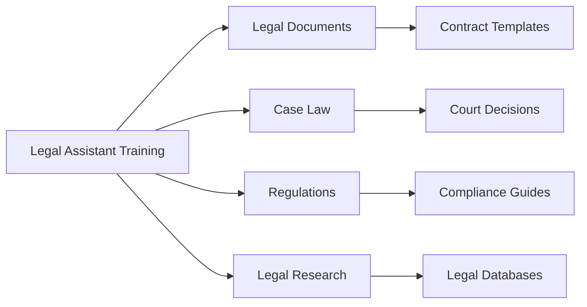

### Designer Agent Training Sources
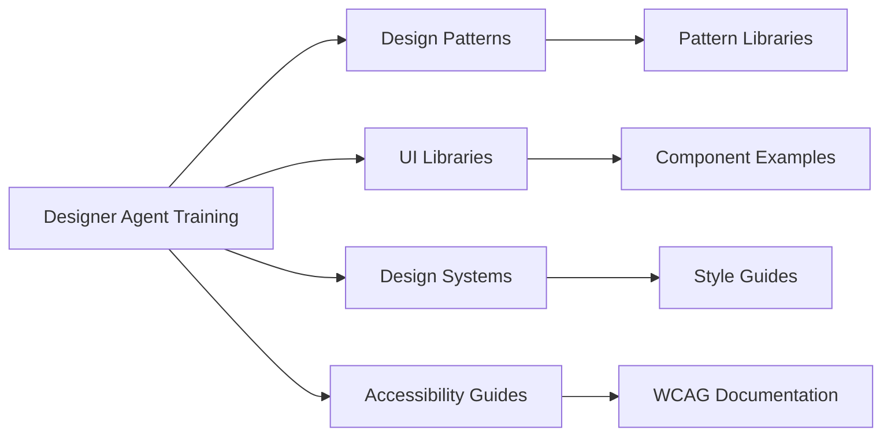

## Implementation Timeline

### Phase 1: Data Infrastructure (Months 1-2)
- Set up data collection systems
- Implement conversation logging
- Build feedback collection interface
- Create data processing pipeline

### Phase 2: Training Pipeline (Months 3-4)
- Develop automated training system
- Implement model validation framework
- Set up A/B testing infrastructure
- Create deployment automation

### Phase 3: Quality Assurance (Months 5-6)
- Build comprehensive testing suite
- Implement safety and bias detection
- Create performance monitoring
- Develop rollback mechanisms

### Phase 4: Continuous Learning (Months 7-8)
- Enable real-time learning
- Implement adaptive training schedules
- Create personalization features
- Optimize for efficiency

## Monitoring and Metrics

### Performance Metrics
- Response accuracy and relevance
- User satisfaction scores
- Task completion rates
- Response time and latency

### Learning Metrics
- Training data quality scores
- Model improvement rates
- Feature adoption metrics
- User engagement patterns

### Safety Metrics
- Harmful content detection rates
- Bias measurement scores
- Privacy compliance metrics
- Security incident tracking

## RAISE Framework Components

The enhanced self-learning pipeline now incorporates RAISE framework elements:

#### Example Database Processing

- **Successful Interactions**: Store high-quality query-response pairs
- **Reasoning Traces**: Capture scratchpad content and decision processes
- **Tool Usage Patterns**: Record effective tool selection strategies
- **Context Preservation**: Maintain conversation context for examples

#### Scratchpad Analysis

- **Reasoning Quality Assessment**: Evaluate logical flow and coherence
- **Pattern Recognition**: Identify common reasoning strategies
- **Error Analysis**: Learn from failed reasoning attempts
- **Optimization Opportunities**: Discover more efficient reasoning paths

#### Working Memory Optimization

- **Context Management**: Efficient loading and updating of conversation history
- **Example Retrieval**: Fast similarity-based example matching
- **Memory Allocation**: Optimal use of working memory resources
- **Performance Tuning**: Continuous optimization of memory operations

#### Controller Learning

- **Decision Patterns**: Learn optimal tool selection strategies
- **Workflow Optimization**: Improve agent coordination and handoffs
- **Error Recovery**: Develop better error handling and recovery mechanisms
- **Adaptation Strategies**: Learn to adapt to new domains and use cases

## Privacy and Security

### Data Protection
- End-to-end encryption for all user data
- Anonymization of training datasets
- Secure data storage and transmission
- Regular security audits

### User Control
- Opt-out mechanisms for data collection
- Data deletion and portability rights
- Transparency in data usage
- Granular privacy controls

### Compliance
- GDPR compliance for EU users
- CCPA compliance for California users
- SOC 2 Type II certification
- Regular compliance audits
