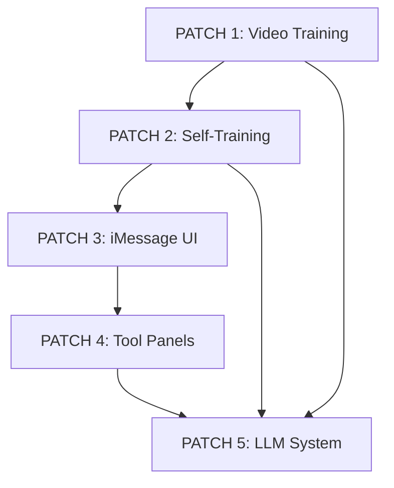

# BATCH 5 CHECKLIST: Complete AI Agent Transformation
## Combining Patches 2-5 for Revolutionary Enhancement

### 🎯 OBJECTIVE
Transform AGENT into a cutting-edge AI system with self-training capabilities, modern iMessage-style interface, dynamic tool panels, and complete independence from OpenAI through custom LLM integration.

**Timeline**: 12-16 weeks | **Priority**: CRITICAL | **Impact**: REVOLUTIONARY

---

## 📦 PATCH INTEGRATION PLAN

### PATCH 2: Self-Training with Bias Mitigation (Weeks 1-4)
**Status**: 🔄 READY TO START
- **Core Focus**: Build the foundation for self-improving AI
- **Key Deliverables**: Bias detection, autocorrelation mapping, self-evaluation
- **Dependencies**: Video training data from Patch 1

### PATCH 3: iMessage-Style Chat UI (Weeks 5-8) 
**Status**: 🔄 READY TO START
- **Core Focus**: Transform user experience with modern chat interface
- **Key Deliverables**: Message bubbles, animations, gestures, real-time features
- **Dependencies**: Enhanced backend from Patch 2

### PATCH 4: Dynamic Tool Panel UI (Weeks 9-12)
**Status**: 🔄 READY TO START
- **Core Focus**: Split-screen tool system with horizontal scrolling cards
- **Key Deliverables**: Panel transitions, tool cards, responsive design
- **Dependencies**: Chat UI foundation from Patch 3

### PATCH 5: LLM Model Replacement (Weeks 13-16)
**Status**: 🔄 READY TO START
- **Core Focus**: Complete OpenAI independence with local LLM
- **Key Deliverables**: GODEL integration, custom training, model switching
- **Dependencies**: All previous patches for optimal integration

---

## 🏗️ IMPLEMENTATION ROADMAP

### Phase 1: Foundation (Weeks 1-4) - PATCH 2
#### Week 1: Self-Training Research & Setup
- [ ] **Day 1-2**: Research bias mitigation techniques
  - [ ] Survey latest bias detection papers
  - [ ] Analyze self-training best practices
  - [ ] Study autocorrelation mapping techniques
  
- [ ] **Day 3-4**: Algorithm Development
  - [ ] Implement bias detection metrics
  - [ ] Create autocorrelation analysis tools
  - [ ] Develop pattern anomaly detection
  
- [ ] **Day 5-7**: Core Integration
  - [ ] Create `agent/self_training/` module
  - [ ] Implement bias monitoring dashboards
  - [ ] Add self-evaluation framework

#### Week 2: Autocorrelation Mapping
- [ ] **Day 8-10**: Pattern Analysis System
  - [ ] Pattern correlation analysis implementation
  - [ ] Temporal dependency detection
  - [ ] Cyclic pattern identification
  
- [ ] **Day 11-12**: Anomaly Detection
  - [ ] Anomaly pattern flagging system
  - [ ] Performance drift detection
  - [ ] Quality degradation alerts
  
- [ ] **Day 13-14**: Integration Testing
  - [ ] Bias testing with synthetic data
  - [ ] Pattern analysis validation
  - [ ] Performance monitoring setup

#### Week 3: Meta-Learning Architecture
- [ ] **Day 15-17**: Learning System
  - [ ] Learning-to-learn capabilities
  - [ ] Few-shot adaptation mechanisms
  - [ ] Transfer learning optimization
  
- [ ] **Day 18-19**: Safety Measures
  - [ ] Rollback mechanisms
  - [ ] A/B testing framework
  - [ ] Safety constraint implementation
  
- [ ] **Day 20-21**: Training Pipeline
  - [ ] Self-training engine implementation
  - [ ] Automated hyperparameter optimization
  - [ ] Training data quality assessment

#### Week 4: Testing & Documentation
- [ ] **Day 22-24**: Comprehensive Testing
  - [ ] Bias variance testing (<2% target)
  - [ ] Pattern detection accuracy (>98% target)
  - [ ] Performance consistency validation
  
- [ ] **Day 25-28**: Documentation & Deployment
  - [ ] Technical documentation completion
  - [ ] Deployment to production
  - [ ] Monitoring dashboard setup

### Phase 2: User Experience (Weeks 5-8) - PATCH 3
#### Week 5: Core Chat Components
- [ ] **Day 29-31**: Message System
  - [ ] Dynamic message bubble creation
  - [ ] Sent/received message states
  - [ ] Real-time message updates
  
- [ ] **Day 32-33**: UI Components
  - [ ] MessageBubble component
  - [ ] MessageInput component
  - [ ] ConversationView component
  
- [ ] **Day 34-35**: State Management
  - [ ] Message queue system
  - [ ] Optimistic UI updates
  - [ ] Error handling and retry logic

#### Week 6: Animation Framework
- [ ] **Day 36-38**: Animation System
  - [ ] Message send animations
  - [ ] Bubble entrance/exit transitions
  - [ ] Typing indicator animations
  
- [ ] **Day 39-40**: Interactive Gestures
  - [ ] Swipe actions implementation
  - [ ] Long press menus
  - [ ] Double-tap reactions
  
- [ ] **Day 41-42**: Performance Optimization
  - [ ] 60fps animation targets
  - [ ] Hardware acceleration
  - [ ] Memory management

#### Week 7: Real-Time Features
- [ ] **Day 43-45**: WebSocket Integration
  - [ ] Real-time message delivery
  - [ ] Typing indicators
  - [ ] Read receipts
  
- [ ] **Day 46-47**: Advanced Features
  - [ ] Message reactions/emotions
  - [ ] Quick reply suggestions
  - [ ] Draft saving
  
- [ ] **Day 48-49**: Mobile Optimization
  - [ ] Touch optimization
  - [ ] Responsive design
  - [ ] Performance tuning

#### Week 8: Testing & Polish
- [ ] **Day 50-52**: UI Testing
  - [ ] Cross-browser compatibility
  - [ ] Animation smoothness validation
  - [ ] Accessibility compliance
  
- [ ] **Day 53-56**: Integration & Deployment
  - [ ] Backend integration
  - [ ] Production deployment
  - [ ] User experience validation

### Phase 3: Tool Integration (Weeks 9-12) - PATCH 4
#### Week 9: Layout Architecture
- [ ] **Day 57-59**: Split-Screen System
  - [ ] Dynamic left/right panel sizing
  - [ ] Responsive breakpoint handling
  - [ ] Smooth resize animations
  
- [ ] **Day 60-61**: Tool Panel Framework
  - [ ] Right-side panel container
  - [ ] Horizontal scrolling implementation
  - [ ] Card-based tool layout
  
- [ ] **Day 62-63**: Chat UI Positioning
  - [ ] Floating bottom positioning
  - [ ] Dynamic width adjustment
  - [ ] Panel-aware positioning

#### Week 10: Transition System
- [ ] **Day 64-66**: App-to-Tool Transitions
  - [ ] Smooth panel slide-in animations
  - [ ] Chat repositioning transitions
  - [ ] Tool loading states
  
- [ ] **Day 67-68**: Tool Cards System
  - [ ] Horizontal scrolling cards
  - [ ] Card snap behavior
  - [ ] Interactive card elements
  
- [ ] **Day 69-70**: State Management
  - [ ] Active tool tracking
  - [ ] Panel visibility states
  - [ ] Multi-tool support

#### Week 11: Mode-Specific Tools
- [ ] **Day 71-73**: Developer Tools
  - [ ] Code editor panel
  - [ ] Terminal interface
  - [ ] File browser
  
- [ ] **Day 74-75**: Data Engineer Tools
  - [ ] Data preview tables
  - [ ] Pipeline visualizer
  - [ ] Query builder
  
- [ ] **Day 76-77**: Trading & Research Tools
  - [ ] Chart displays
  - [ ] Reference manager
  - [ ] Note taking interface

#### Week 12: Testing & Optimization
- [ ] **Day 78-80**: Performance Testing
  - [ ] Panel transition speed (<300ms)
  - [ ] Animation frame rate (60fps)
  - [ ] Memory usage optimization
  
- [ ] **Day 81-84**: Integration & Deployment
  - [ ] Cross-device testing
  - [ ] Production deployment
  - [ ] User workflow validation

### Phase 4: LLM Independence (Weeks 13-16) - PATCH 5
#### Week 13: Model Research & Setup
- [ ] **Day 85-87**: Model Selection
  - [ ] Download GODEL-v1.1-large-seq2seq
  - [ ] Test alternative models (DialoGPT, Llama-2, Mistral)
  - [ ] Benchmark performance metrics
  
- [ ] **Day 88-89**: Infrastructure Setup
  - [ ] Create `agent/local_llm/` module
  - [ ] Model manager implementation
  - [ ] Memory optimization setup
  
- [ ] **Day 90-91**: Interface Development
  - [ ] OpenAI-compatible API wrapper
  - [ ] Streaming response support
  - [ ] Token counting system

#### Week 14: Training Pipeline
- [ ] **Day 92-94**: Training Infrastructure
  - [ ] Fine-tuning pipeline setup
  - [ ] LoRA/QLoRA implementation
  - [ ] Training data management
  
- [ ] **Day 95-96**: Specialized Training
  - [ ] Video understanding integration
  - [ ] Conversation style adaptation
  - [ ] Safety training implementation
  
- [ ] **Day 97-98**: Monitoring System
  - [ ] Training progress tracking
  - [ ] Model checkpoint management
  - [ ] Performance metrics

#### Week 15: Advanced Features
- [ ] **Day 99-101**: Multi-Modal Integration
  - [ ] Video training system connection
  - [ ] Image understanding capabilities
  - [ ] Audio processing integration
  
- [ ] **Day 102-103**: Context Management
  - [ ] Long conversation memory
  - [ ] Context compression techniques
  - [ ] Important information retention
  
- [ ] **Day 104-105**: Model Ensembling
  - [ ] Multiple model coordination
  - [ ] Specialist model routing
  - [ ] Performance comparison

#### Week 16: Integration & Testing
- [ ] **Day 106-108**: API Replacement
  - [ ] Replace OpenAI calls in core.py
  - [ ] Update enhanced_agent.py
  - [ ] Maintain backwards compatibility
  
- [ ] **Day 109-110**: Quality Testing
  - [ ] Conversation quality tests
  - [ ] Performance benchmarking
  - [ ] Safety validation
  
- [ ] **Day 111-112**: Production Deployment
  - [ ] Final integration testing
  - [ ] Production rollout
  - [ ] Monitoring setup

---

## 🎯 CRITICAL SUCCESS METRICS

### Technical Performance
- **Self-Training**: <2% bias variance, >98% pattern detection
- **Chat UI**: 60fps animations, <100ms interaction response
- **Tool Panels**: <300ms transitions, 5+ simultaneous tools
- **LLM System**: <2s response time, 90%+ quality vs OpenAI

### User Experience
- **Interface**: Native app feel, smooth animations
- **Functionality**: All existing features maintained and enhanced
- **Performance**: No degradation in existing capabilities
- **Accessibility**: Full compliance with accessibility standards

### Business Impact
- **Cost Reduction**: 80%+ reduction in API costs
- **Independence**: Complete OpenAI independence
- **Scalability**: Support for 1000+ concurrent users
- **Reliability**: 99.9% uptime target

---

## 🔄 INTEGRATION DEPENDENCIES

### Cross-Patch Dependencies

### Technical Integration Points
- **Patch 2 → 3**: Enhanced backend feeds improved chat experience
- **Patch 3 → 4**: Chat UI foundation enables tool panel integration
- **Patch 4 → 5**: Tool system optimized for local LLM capabilities
- **Patch 2 → 5**: Self-training data improves LLM fine-tuning
- **Patch 1 → 5**: Video training enhances multi-modal capabilities

---

## 🚨 RISK MITIGATION

### High-Risk Areas
1. **Model Performance**: Ensure local LLM matches OpenAI quality
2. **Animation Performance**: Maintain 60fps across all devices
3. **Integration Complexity**: Manage dependencies between patches
4. **Resource Requirements**: GPU/memory needs for local LLM

### Mitigation Strategies
- **Gradual Rollout**: Deploy patches incrementally with feature flags
- **Fallback Systems**: Maintain OpenAI compatibility during transition
- **Performance Monitoring**: Real-time metrics for all components
- **Testing Coverage**: Comprehensive testing at each integration point

---

## 📋 DEPLOYMENT CHECKLIST

### Pre-Deployment
- [ ] All patch components tested individually
- [ ] Integration testing completed
- [ ] Performance benchmarks met
- [ ] Security audit passed
- [ ] Documentation completed

### Production Deployment
- [ ] Feature flags configured
- [ ] Monitoring systems active
- [ ] Rollback procedures tested
- [ ] User communication prepared
- [ ] Support team trained

### Post-Deployment
- [ ] Performance monitoring active
- [ ] User feedback collection
- [ ] Issue tracking system ready
- [ ] Continuous improvement plan

---

**BATCH 5 STATUS**: ⚡ READY TO BEGIN
**ESTIMATED COMPLETION**: 16 weeks (112 days)
**COMPLEXITY**: VERY HIGH
**IMPACT**: REVOLUTIONARY - Complete transformation of AGENT system

This batch represents the culmination of all planned enhancements, creating a truly next-generation AI agent with unparalleled capabilities and complete independence from external dependencies.
