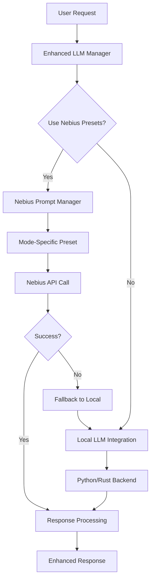

# Nebius Prompt Presets Integration Guide

## Overview

The AGENT LLM system now integrates with Nebius AI Studio for advanced prompt preset management, providing specialized prompts for each training data mode and enabling hybrid processing between cloud and local backends.

## Features

### 🎯 Mode-Specific Prompt Presets
- **12 Specialized Modes**: Each training data mode has dedicated prompt presets
- **Automatic Preset Creation**: Default presets created automatically for all modes
- **Custom Preset Support**: Create and manage custom presets for specific use cases
- **Dynamic Model Selection**: Different models optimized for different modes

### 🔄 Hybrid Processing Architecture
- **Nebius-First Strategy**: Prioritizes Nebius presets for enhanced responses
- **Intelligent Fallback**: Automatic fallback to local backends when needed
- **Load Balancing**: Distributes requests between cloud and local processing
- **Performance Optimization**: Caching and request optimization

### 📊 Comprehensive Monitoring
- **Health Checks**: Real-time monitoring of all integration components
- **Performance Metrics**: Detailed tracking of response times and success rates
- **System Status**: Complete visibility into system health and configuration

## Quick Start

### 1. Environment Setup

```bash
# Set your Nebius API key
export NEBIUS_API_KEY="your_nebius_api_key_here"

# Install dependencies
pip install aiohttp pyyaml asyncio
```

### 2. Basic Usage

```python
from agent.enhanced_llm_integration import get_enhanced_llm_manager
from agent.llm_integration import LLMRequest

# Initialize the enhanced LLM manager
manager = get_enhanced_llm_manager()
await manager.initialize()

# Create a request for design mode
request = LLMRequest(
    query="Design a modern dashboard for data visualization",
    context=["Real-time analytics", "Mobile responsive"],
    task_type="design"
)

# Process with Nebius presets
response = await manager.process_request_enhanced(request)
print(response.content)
```

### 3. Configuration

The system uses YAML configuration in `config/nebius_config.yaml`:

```yaml
nebius:
  use_nebius_presets: true
  fallback_to_local: true
  auto_create_presets: true
  mode_models:
    design: "deepseek-ai/DeepSeek-V3-0324-fast"
    security: "meta-llama/Llama-3.3-70B-Instruct"
```

## Mode-Specific Capabilities

### Design Mode
- **Focus**: UI/UX design, 3D modeling, visual creation
- **Model**: DeepSeek-V3 (optimized for creative tasks)
- **Specialties**: Spline 3D, React components, design systems

### Security Mode
- **Focus**: Cybersecurity analysis, threat detection
- **Model**: Llama-3.3-70B (optimized for analytical tasks)
- **Specialties**: Vulnerability assessment, compliance, incident response

### Development Mode
- **Focus**: Code generation, architecture design
- **Model**: DeepSeek-V3 (optimized for code generation)
- **Specialties**: TypeScript, React, full-stack development

### Analysis Mode
- **Focus**: Data analysis, business intelligence
- **Model**: Llama-3.3-70B (optimized for analytical reasoning)
- **Specialties**: Statistical analysis, pattern recognition, insights

### Communication Mode
- **Focus**: Technical writing, documentation
- **Model**: DeepSeek-V3 (optimized for language tasks)
- **Specialties**: API documentation, user guides, technical communication

### Automation Mode
- **Focus**: Process optimization, workflow automation
- **Model**: Llama-3.3-70B (optimized for systematic thinking)
- **Specialties**: RPA, workflow design, efficiency optimization

### Research Mode
- **Focus**: Information gathering, knowledge synthesis
- **Model**: Llama-3.3-70B (optimized for research tasks)
- **Specialties**: Literature review, data synthesis, trend analysis

### Reasoning Mode
- **Focus**: Logical analysis, problem-solving
- **Model**: Llama-3.3-70B (optimized for reasoning)
- **Specialties**: Critical thinking, decision frameworks, logic

### Creative Mode
- **Focus**: Content creation, artistic generation
- **Model**: DeepSeek-V3 (optimized for creativity)
- **Specialties**: Storytelling, creative writing, content strategy

### Educational Mode
- **Focus**: Teaching, knowledge transfer
- **Model**: DeepSeek-V3 (optimized for explanation)
- **Specialties**: Instructional design, curriculum development, pedagogy

### Diagnostic Mode
- **Focus**: Problem identification, troubleshooting
- **Model**: Llama-3.3-70B (optimized for systematic analysis)
- **Specialties**: Root cause analysis, debugging, system diagnosis

### Optimization Mode
- **Focus**: Performance tuning, efficiency improvement
- **Model**: Llama-3.3-70B (optimized for optimization)
- **Specialties**: Performance analysis, resource optimization, scalability

## Advanced Usage

### Creating Custom Presets

```python
# Create a custom preset for specialized tasks
custom_preset = await manager.create_custom_preset(
    mode="development",
    name="React TypeScript Expert",
    system_prompt="You are a React TypeScript expert...",
    user_template="Development Request: {user_input}...",
    description="Specialized for React TypeScript development"
)
```

### System Monitoring

```python
# Get comprehensive system status
status = await manager.get_system_status()
print(f"Nebius Health: {status['nebius_integration']['health']}")
print(f"Presets Loaded: {status['nebius_integration']['presets_loaded']}")
```

### Performance Optimization

```python
# Optimize system performance
await manager.optimize_performance()
```

## API Reference

### EnhancedLLMManager

#### Methods

- `initialize()`: Initialize all integrations
- `process_request_enhanced(request, use_preset=True)`: Process request with enhanced capabilities
- `get_mode_capabilities(mode)`: Get capabilities for specific mode
- `create_custom_preset(mode, name, system_prompt, ...)`: Create custom preset
- `get_system_status()`: Get comprehensive system status
- `optimize_performance()`: Optimize system performance
- `shutdown()`: Graceful shutdown

### Configuration Classes

- `EnhancedLLMConfig`: Main configuration class
- `NebiusConfig`: Nebius-specific configuration
- `BackendConfig`: Local backend configuration
- `LLMConfig`: LLM model configuration

## Integration Architecture



## Best Practices

### 1. Mode Selection
- Choose the appropriate mode based on task requirements
- Use specialized modes for better results
- Consider hybrid approaches for complex tasks

### 2. Prompt Engineering
- Provide clear, specific context in requests
- Use structured input for better results
- Test different prompt variations

### 3. Performance Optimization
- Enable caching for frequently used presets
- Use appropriate timeout settings
- Monitor system performance regularly

### 4. Error Handling
- Always enable fallback to local processing
- Implement proper retry logic
- Monitor API rate limits

### 5. Security
- Rotate API keys regularly
- Use environment variables for sensitive data
- Enable request logging for debugging

## Troubleshooting

### Common Issues

#### Nebius API Connection Failed
```
Solution: Check API key and network connectivity
- Verify NEBIUS_API_KEY environment variable
- Test network access to api.studio.nebius.com
- Check API key expiration date
```

#### Preset Creation Failed
```
Solution: Verify permissions and quota
- Check API key permissions
- Verify account quota limits
- Review preset parameters
```

#### Local Fallback Not Working
```
Solution: Check local backend status
- Verify Python/Rust backends are running
- Check port availability (8000, 8001)
- Review backend configuration
```

### Debug Mode

Enable debug mode for detailed logging:

```python
config = EnhancedLLMConfig(
    # ... other config
    debug_mode=True,
    verbose_logging=True
)
```

## Examples

See `examples/nebius_integration_example.py` for comprehensive usage examples including:

- Basic setup and initialization
- Mode-specific request processing
- Custom preset creation
- System monitoring and status
- Performance benchmarking
- Error handling and recovery

## Support

For issues and questions:

1. Check the troubleshooting section above
2. Review system logs in `agent/enhanced_llm_integration.log`
3. Test with the provided examples
4. Verify configuration settings

## Changelog

### v1.0.0 (Current)
- Initial Nebius integration
- 12 specialized mode presets
- Hybrid processing architecture
- Comprehensive monitoring and status
- Performance optimization
- Custom preset creation
- Intelligent fallback system
